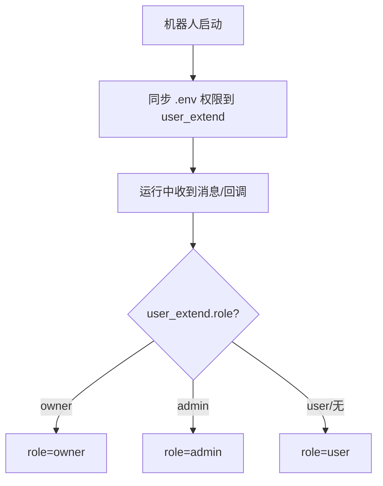

# Python Engineering Standards for Telegram Bot

This project must follow clean architecture and maintainable engineering practices.

---

## 项目快速认知（新对话直接看这里）

### 权限体系（只允许 3 级）

- user：普通用户，默认权限
- admin：管理员，可执行管理相关操作（可多个）
- owner：所有者，最高权限（唯一）

项目中不允许出现其它权限等级（例如 superadmin、vip、staff 等）。

### 角色来源与判定顺序（以实际代码为准）

运行时角色判定只认数据库 `user_extend.role`。

`.env` 中的 `OWNER_ID` / `ADMIN_IDS` 仅用于启动时初始化/补全数据库权限（不要在运行时用 env 兜底判定权限）：
- `OWNER_ID`：必须存在记录，且必须为 `owner`（必要时提升为 owner）
- `ADMIN_IDS`：仅当 `user_extend` 不存在记录时创建为 `admin`；若已存在记录则不改动其 role



关键点：
- 运行时不读取 env 权限，只读数据库
- 启动阶段做一次 env -> 数据库 的初始化/补全（后续权限变更以数据库为准）

对应实现参考：
- bot/runtime/hooks.py 的 on_startup
- bot/services/users.py 的 sync_roles_from_settings_on_startup
- bot/utils/permissions.py 的 _resolve_role、require_owner、require_admin_priv

### 权限校验的推荐写法（避免各处重复判断）

- owner 专用：使用 require_owner 装饰器保护处理器
- admin/owner 专用：使用 require_admin_priv 装饰器保护处理器
- 不推荐在 handlers 里手写“查表/读 env/读配置”做权限判断（容易重复、也容易出现多处口径不一致）

### 什么时候用 Filter，什么时候用装饰器

两者本质都是“让处理器在特定条件下才会执行”，区别主要在于：复用粒度、可组合性、是否需要统一的拒绝提示、以及依赖的数据源。

```mermaid
flowchart TD
  A[需要做权限/条件限制] --> B{限制是否属于\n“路由层过滤”？}
  B -- 是 --> F[用 Filter\n(写在 @router.message(...) 里)]
  B -- 否/需要统一提示 --> D[用装饰器\n(require_* / feature 开关等)]
  F --> C{条件是否只依赖 message/callback\n+ session 且不需要统一提示?}
  C -- 是 --> OK1[Filter 最合适]
  C -- 否 --> D
```

推荐规则（本项目）：
- 需要做权限判断，并且希望统一返回“无权限”提示：用装饰器（require_owner / require_admin_priv）
- 需要对“某类消息形态”做过滤（例如只处理私聊、只处理带参数、只处理某种内容类型），且不需要统一提示：用 Filter
- 需要给 CallbackQuery 和 Message 两种入口都做一致的拒绝提示：优先用装饰器（装饰器里统一处理 Message/CallbackQuery）

容易踩坑的点：
- Filter 通常是“静默跳过”更自然；如果你想提示用户“你没权限”，Filter 也能做，但经常会把提示逻辑分散到多个 Filter 里，后期不好统一
- 权限判断不要依赖 env：env 仅用于启动时初始化/补全数据库权限

---

## 命令结构（强制约束）

命令处理器必须放在以下目录之一（权限由目录决定）：
- handlers/command/user/
- handlers/command/admin/
- handlers/command/owner/

禁止创建其它权限目录（group/mod/superadmin/staff/vip/misc/utils 等）。

命令文件名只描述功能，不包含权限前缀：
- 错误：admin_ban.py、owner_stats.py
- 正确：ban.py、stats.py

每个命令模块必须声明 COMMAND_META：

```python
COMMAND_META = {
    "name": "ban",
    "alias": "b",
    "usage": "/ban <user>",
    "desc": "封禁用户"
}
```

---

## 项目关键约定（必须遵守）

- 分层职责
  - handlers：只处理 Telegram 交互（收消息、发消息、按钮回调、状态机）
  - services：业务逻辑
  - repositories：数据库访问
  - utils：纯工具函数
- SQLAlchemy 软删除过滤必须使用 Model.is_deleted.is_(False)（禁止 not Model.is_deleted）
- 新增写入数据库的记录，尽量填写 remark/description/extra 等说明字段，便于排查
- Ruff 全局忽略 RUF003（允许中文全角标点）
- 更新 EmbyUserModel 前必须使用 bot.services.emby_update_helper.detect_and_update_emby_user（Snapshot-First + 历史记录）

---

## 运行与重启约定

- 本项目启动命令：python -m bot
- 修改代码后重启流程：先显式停止旧进程，再启动新进程

---

## Commit Message Rules

All git commit messages MUST:

- Be written in Chinese
- Clearly describe the purpose of the change
- Follow this format:

<类型>: <简要说明>

Examples:

- 新增: 管理员封禁命令
- 修复: 用户注册逻辑异常
- 优化: 命令扫描性能
- 重构: 权限校验逻辑复用
- 移除: 无用的重复函数

Do NOT use English commit messages.
Do NOT use meaningless messages such as:

- update
- fix bug
- change
- test

---

## Code Reuse

When modifying or adding functionality:

- Check existing services, utils, handlers first
- Reuse existing logic if similar functionality exists
- DO NOT duplicate validation or permission logic
- Extract shared logic into services or utils

Repeated logic MUST be refactored into reusable functions.

---

## Architecture Rules

Follow separation of concerns:

- handlers: Telegram interaction only
- services: business logic
- repositories: database access
- utils: pure helper functions

Handlers MUST NOT contain business logic.

---

## Code Quality

All generated or modified code MUST be:

- Concise
- Efficient
- Elegant
- Readable
- Extensible
- Modular

Avoid:

- Long functions (>50 lines)
- Nested condition chains
- Hardcoded values
- Duplicate database queries
- Repeated permission checks

---

## File Structure Planning

When adding new features:

- Place logic into correct layer (handler/service/repository)
- Do NOT overload existing modules
- Create new module only if responsibility differs
- Group related functionality logically

---

## Refactoring Behavior

When modifying code:

- Prefer refactoring over rewriting
- Remove unused functions
- Replace duplicate logic with shared methods
- Maintain backward compatibility when possible

---

## Performance Awareness

Avoid:

- Unnecessary loops
- Repeated DB calls inside handlers
- Blocking operations in async handlers

Use async patterns properly when interacting with DB or IO.

---

Never generate redundant code.
Always prioritize reuse and maintainability.
