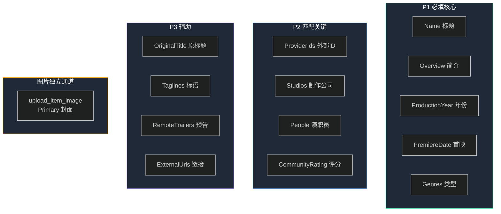

# Emby Item 可更新属性清单

> 基于 item 26222（模拟电影"测试电影：夜航星河"，Type=Movie）的真实 DTO 整理。
> Emby 版本：4.9.5.0。适用于 `bot/core/emby.py` 的 `update_item` / `upload_item_image`。

## 1. 更新机制（重要）

Emby 的 `POST /Items/{ItemId}` 接受**完整 BaseItemDto**，但只落地"元数据字段"，系统/媒体字段会被忽略或保留。

**安全更新流程**（设计方案 5.1 的核心约束）：

- **先读后写**：直接构造 DTO 回写会丢字段，必须先 `get_item` 拿到完整 DTO，只改你想改的字段，再整体 `POST` 回去。
- **图片不走 update_item**：Primary/Logo/Thumb/Backdrop 图片用 `upload_item_image` 上传 base64，`update_item` 里的 `ImageTags` 是只读哈希，上传后由 Emby 重算。
- **不要动系统字段**：传了也无效，但乱改可能引发意外。下表标注"只读"的字段回写时保持原值即可。

## 2. 字段分类总表

item 26222 实测 49 个字段，按可更新性分五类：

| 类别 | 数量 | 能否用 update_item 改 | 说明 |
|------|------|---------------------|------|
| **A. 主要元数据** | 10 | ✅ 能 | gv-data-capture 重点更新对象 |
| **B. 辅助元数据** | 8 | ✅ 能 | 可选更新，影响展示/排序 |
| **C. 系统字段** | 14 | ❌ 只读 | 标识/层级/时间，回写保持原值 |
| **D. 用户相关** | 3 | ❌ 不动 | 权限/播放数据，属用户上下文 |
| **E. 媒体文件信息** | 12 | ❌ 只读 | 来自文件扫描，改了也会被覆盖 |
| (图片相关) | 2 | ❌ 只读(哈希) | 用 upload_item_image 间接更新 |

## 3. A. 主要元数据（重点更新）

这些是 gv-data-capture 从数据源抓取后写回的核心字段：

| 字段 | 类型 | 含义 | 26222 实测值 |
|------|------|------|-------------|
| `Name` | str | 标题（显示名） | 测试电影：夜航星河 |
| `OriginalTitle` | str | 原标题（原文） | Test Movie: Night Flight |
| `Overview` | str | 简介/剧情 | 用于后端联调的模拟 Emby Item… |
| `PremiereDate` | str(ISO) | 首映日期 | 2016-08-17T16:00:00.0000000Z |
| `ProductionYear` | int | 制作年份 | 2024 |
| `Genres` | list[str] | 类型原始值，便于展示与搜索 | ["剧情","爱情","喜剧"] |
| `GenreItems` | list[dict] | 实际写回 Emby 的类型对象列表，每项 `{Name}` | [{"Name":"剧情"},{"Name":"爱情"}] |
| `Studios` | list[dict] | 制作公司，每项 `{Name, Id}`；新建时可仅传 `{Name}` | [{"Name":"Mock Studio","Id":26617}] |
| `People` | list[dict] | 演职员，每项含 `Name/Id/Role/Type` | [{"Name":"Gabriel Epstein","Role":"Germán","Type":"Actor"}] |
| `ProviderIds` | dict | 外部 ID，键为来源（Tmdb/Imdb） | {"Tmdb":"mock-tmdb-001"} |
| `CommunityRating` | float | 社区评分 | 默认空 step=".1" min="0" max="10" |
| `OfficialRating` | str | 家长评分 | XXX |
| `CustomRating` | str | 自定义评分 | XXX |

> `Studios`/`People`/`GenreItems`/`TagItems` 的 `Id` 是 Emby 内部关联 ID。新建时传 `{"Name": "..."}` 即可，Emby 会自动建关联实体；更新现有项保留原 Id。

## 4. B. 辅助元数据（可选更新）

影响排序、展示、锁定：

| 字段 | 类型 | 含义 | 26222 实测值 |
|------|------|------|-------------|
| `SortName` | str | 排序名 | 测试电影：夜航星河 |
| `ForcedSortName` | str | 强制排序名 | 测试电影：夜航星河 |
| `Taglines` | list[str] | 标语/副标题 | [] |
| `ExternalUrls` | list[dict] | 外部链接 `{Name,Url}` | [{"Name":"TheMovieDb","Url":"…"}] |
| `RemoteTrailers` | list[dict] | 远程预告片 `{Url}` | [{"Url":"https://youtube…"}] |
| `ProductionLocations` | list[str] | 制作地 | ["Argentina"] |
| `LockedFields` | list[str] | 锁定的字段（防覆盖） | [] |
| `LockData` | bool | 是否锁定元数据 | false |

> `LockedFields`/`LockData` 是元数据锁定开关：写入后可防止 Emby 重新扫描时覆盖人工编辑。

## 5. C. 系统字段（只读，回写保持原值）

| 字段 | 类型 | 含义 | 26222 实测值 |
|------|------|------|-------------|
| `Id` | str | Item ID | 26222 |
| `ServerId` | str | 服务器 ID | 6a166db9… |
| `Etag` | str | 版本哈希（并发控制） | 74362743… |
| `DateCreated` | str(ISO) | 创建时间 | 2026-07-18T23:29:13Z |
| `DateModified` | str(ISO) | 修改时间 | 2026-07-18T23:29:13Z |
| `PresentationUniqueKey` | str | 去重键 | p-tmdb-Movie-413666-… |
| `IsFolder` | bool | 是否文件夹 | false |
| `ParentId` | str | 父级 ID（库/文件夹） | 26221 |
| `Type` | str | Item 类型 | Movie |
| `MediaType` | str | 媒体大类 | Video |
| `Path` | str | 文件路径 | /mnt/webdav/media/…/Taekwondo (2016).mkv |
| `FileName` | str | 文件名 | Taekwondo (2016).mkv |
| `Container` | str | 容器格式 | mkv |
| `TagItems` | list | 标签实体；本项目由候选 `tags` 映射为 `[{Name: ...}]` 写入 | [] |
| `LocalTrailerCount` | int | 本地预告片数 | 0 |
| `DisplayPreferencesId` | str | 显示偏好 ID | dbf7709c… |
| `PrimaryImageAspectRatio` | int/float | 主图宽高比 | 1 |
| `PartCount` | int | 分片数 | 1 |

## 6. D. 用户相关（不要在元数据更新里动）

这些是"当前请求用户"的上下文，不是 Item 自身属性：

| 字段 | 类型 | 含义 | 26222 实测值 |
|------|------|------|-------------|
| `CanDelete` | bool | 当前用户能否删除 | false |
| `CanDownload` | bool | 当前用户能否下载 | false |
| `UserData` | dict | 播放数据 `{PlaybackPositionTicks, PlayCount, IsFavorite, Played}` | {…} |

## 7. E. 媒体文件信息（只读，来自文件扫描）

来自物理文件 probe，改了也会被下次扫描覆盖：

| 字段 | 类型 | 含义 | 26222 实测值 |
|------|------|------|-------------|
| `MediaSources` | list[dict] | 媒体源（含 Chapters/路径/容器） | [{…}] |
| `MediaStreams` | list[dict] | 音视频字幕流（Codec/Language/Width…） | [{Codec:h264…}] |
| `Chapters` | list[dict] | 章节 `{StartPositionTicks, Name}` | [{Name:"章节 1"…}] |
| `RunTimeTicks` | int | 时长（ticks，1s=10⁷） | 64344960000 |
| `Size` | int | 文件大小（字节） | 6771446933 |
| `Bitrate` | int | 比特率 | 8418930 |
| `Width` | int | 视频宽度 | 1920 |
| `Height` | int | 视频高度 | 1080 |

## 8. 图片字段（只读哈希，用 upload_item_image 更新）

| 字段 | 类型 | 含义 | 26222 实测值 |
|------|------|------|-------------|
| `ImageTags` | dict | 各图类型哈希 `{Primary, Logo, Thumb}` | {Primary:d651…, Logo:5615…, Thumb:b5a4…} |
| `BackdropImageTags` | list[str] | 背景图哈希列表 | ["cd228e58…"] |

> 上传新 Primary 图后，`ImageTags.Primary` 哈希会自动更新。`image_type` 取值：`Primary`（主封面）、`Backdrop`（背景）、`Logo`（台标）、`Thumb`（缩略图）、`Art`、`Disc`、`Banner` 等。

## 9. 字段更新优先级（gv-data-capture 落地顺序）

## 10. 联调验证记录

- ✅ `get_system_info()` → ServerName/Version/Id 正常返回
- ✅ `get_users()` → 取得用户上下文（顺手修复 bool 参数序列化 bug）
- ✅ `get_item(uid, "26222")` → 49 字段完整 DTO
- ✅ `update_item("26222", dto)` → `scripts/test_emby_update_item.py` 可逆测试通过（改 Overview→落地→改回，无残留）
- ⏳ `upload_item_image("26222", base64, "Primary")` → 待图片测试（需准备 base64 图片）
