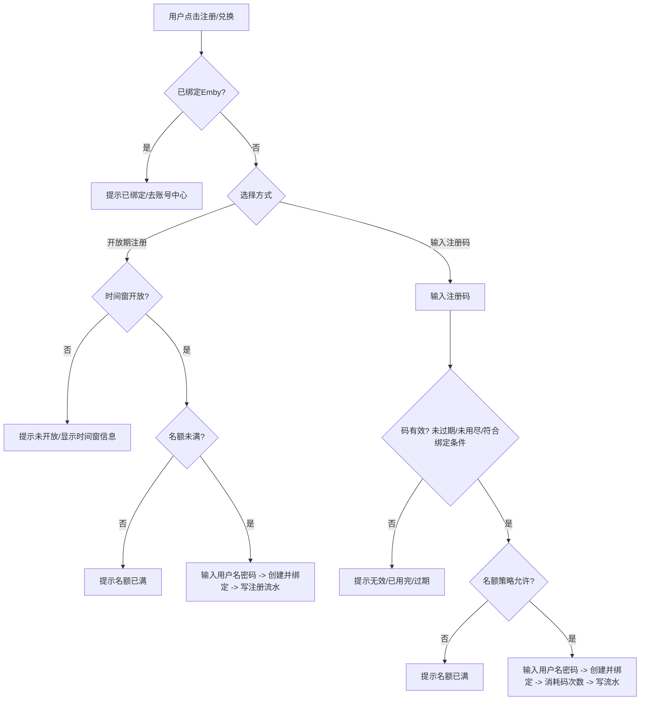
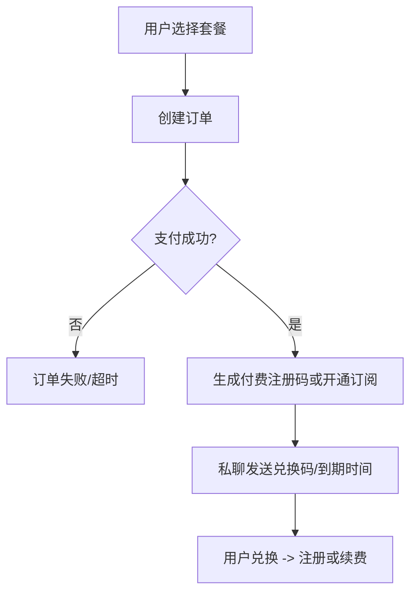

# Emby 注册增强方案设计文档（时间窗 + 名额 + 注册码 + 付费联动 + 精粹活跃）

更新时间：2026-03-18  
目标：在现有“时间窗开放注册”的基础上，新增名额控制、注册码体系、付费订阅联动与精粹（虚拟货币）玩法闭环，用于维持 Emby 服务器成本、提升群活跃与转化收入。

---

## 1. 背景与现状

### 1.1 现有注册开关与入口

- 用户点击注册入口：`user:register`（注册 FSM，提示输入“用户名 密码”）
- 当前开放逻辑：`registration.free_open` 自由开关优先；否则使用 `admin.open_registration.window` 的时间窗（start_time + duration）

可参考代码位置：
- `bot/handlers/user/register.py`
- `bot/services/config_service.py`
- `bot/handlers/admin/registration.py`
- `bot/config/constants.py`

### 1.2 已存在的经济系统（精粹）

- 精粹定义：`CURRENCY_NAME = "精粹"`, `CURRENCY_SYMBOL = "💧"`
- 已具备：余额、签到、商品、购买、流水、可见性/购买条件（例如“需有 Emby 账号”）

可参考代码位置：
- `bot/services/currency.py`
- `bot/core/constants.py`
- `bot/database/models/currency_transaction.py`

### 1.3 现状缺口

- 无“名额上限”控制（当前缺少稳定的窗口名额限制）
- 无“注册码”兑换通道（可计费、可追踪）
- 无“付费订阅 → 到期禁用 → 续费提醒”的闭环
- 精粹虽存在，但与注册/续费/拉新/活跃未形成统一玩法体系

---

## 2. 设计目标与原则

### 2.1 业务目标

- 控制成本：注册名额可控、窗口可控、避免爆量
- 支持收费：通过“付费码/订阅”维持服务器成本
- 提升活跃：精粹玩法驱动签到、贡献、活动参与
- 增加收入：精粹可兑换体验、抵扣券、抽奖门票，导向订阅转化

### 2.2 技术原则

- 可追踪审计：所有注册、兑换、支付、订阅变更应落库可回溯
- 并发安全：注册码次数、名额消耗必须保证“只成功一次”
- 失败可回滚：创建 Emby 失败时不应消耗名额/注册码次数/精粹
- 低耦合：支付与注册解耦，推荐“支付后发码（或开通订阅）→ 用户自助兑换”

---

## 3. 名额控制（Quota）设计（精简版）

### 3.1 名额类型

仅保留 **1 种名额**：

1. **时间窗名额上限**：管理员开启某个时间窗时，该窗口内最多新增 N 个

### 3.2 名额统计口径

名额消耗以“创建并绑定 Emby 成功”为准，统计来自注册事件表（而不是单纯的配置计数）。

### 3.3 建议配置项（概念）

- `registration.quota.window_limit`：int | null

### 3.4 判定优先级（建议）

1. 已绑定 Emby → 直接拒绝重复注册
2. 走注册码通道：
   - 可配置是否绕过“时间窗”
   - 仍受“窗口名额”限制
3. 走开放时间窗通道：
   - 必须在窗口内
   - 必须名额未满

---

## 4. 注册码体系（Code）设计（精简版）

### 4.1 注册码要解决什么

- 将“注册资格”变成“可控量、可定价、可追踪、可裂变”的凭证
- 仅保留一种“通用注册码”，通过配置决定其用途
- 支持基础规则：有效期、次数、绑定用户、是否绕过时间窗

### 4.2 注册码类型（建议）

仅保留：

- `general`：通用注册码（可用于付费发放、活动发放、邀请发放）

### 4.3 用户侧交互建议

将入口拆成两条路径，减少误操作与风控难度：

- 开放期注册：直接输入“用户名 密码”
- 注册码兑换：先输入注册码 → 校验通过后再输入“用户名 密码”

### 4.4 安全建议

- 数据库存储：只存 `code_hash`（明文只在生成时展示一次）
- 防爆破：
  - 每用户每日最大尝试次数
  - 同 IP/同账号短时间失败次数限流（如果有可用信号）
- 审计：
  - 每次兑换尝试应有记录，成功/失败原因可追踪

---

## 5. 付费联动与订阅闭环（维持服务器支持）

### 5.1 核心抽象

将“收费”落在三层：

1. **订单（Order）**：支付事实
2. **套餐（Plan）**：价格与时长定义
3. **订阅（Subscription）**：用户权益与到期时间

### 5.2 推荐商业形态

- 体验（7 天）、月卡、季卡、年卡
- 每套餐可绑定权益模板（可选）：
  - 是否启用/禁用
  - 媒体库权限/标签（VIP 库）
  - 设备数/并发限制（若 Emby 策略支持）

### 5.3 推荐联动方式

优先推荐：**付费成功 → 发放通用注册码 → 用户自助兑换注册/续费**  
优势：解耦、可转赠、便于补发、失败易处理。

### 5.4 到期与续费提醒

- 每日定时扫描到期订阅：
  - 到期 → 自动禁用 Emby 用户（可选宽限期 grace）
  - 到期前 N 天 → Telegram 私聊提醒续费

---

## 6. 精粹联动（活跃 + 拉新 + 收入）

### 6.1 发放：从“刷屏奖励”转为“高质量贡献奖励”

建议不要按“每条群消息发钱”，容易刷屏与风控失控。推荐：

- 签到：稳定基本盘（已存在）
- 贡献奖励：
  - 问答投稿/审核通过：基础 + 通过追加（已有投稿奖励可延伸）
  - 活动参与：答题/互动任务（每日封顶）
- 群活跃奖励（如需）：
  - 必须有“每日封顶、最小字数、去重、冷却时间、异常检测”
  - 建议按“每日有效互动次数”而不是原始消息数

### 6.2 消耗：把精粹花到“留存/转化”上

建议新增或扩展商品/权益：

- 精粹兑换体验码（受名额控制）
- 精粹购买订阅抵扣券（设上限，防止完全白嫖）
- 精粹兑换小额续期（例如 +3 天，每月限 2 次）
- 精粹抽奖门票（每周抽月卡码/季卡码），提升参与感

### 6.3 拉新：通用注册码 + 条件发奖（反作弊）

- 邀请人发放“通用注册码”（可配置为 1 次）
- 新人用码注册成功：
  - 新人获得少量精粹
  - 邀请人奖励延迟发放，需满足留存条件，例如：
    - 新人入群满 7 天且未退群/未封禁
    - 新人完成 X 次签到/活动参与
    - 或新人完成一次付费订阅后，邀请人再得大奖励

---

## 7. 数据模型建议（概念草案）

以下为建议的表结构方向，用于支撑并发安全、审计追溯与统计口径。

### 7.1 注册事件表（名额统计基础）

`registration_events`

- id
- user_id（Telegram）
- emby_user_id
- created_at
- channel：time_window / code
- window_start_at / window_end_at（可选）
- reg_code_id（可选）
- order_id（可选）
- meta（JSON：当时策略快照）

### 7.2 注册码表

`registration_codes`

- id
- code_hash
- type：general
- status：active / disabled / expired
- max_uses
- used_count
- expires_at
- created_by
- bound_user_id（可选）
- plan_id（可选）
- bypass_time_window（bool）
- reward_currency（int，可选）
- meta（JSON：渠道、批次、备注）

`registration_code_redemptions`

- id
- reg_code_id
- user_id
- emby_user_id（成功后）
- redeemed_at
- result：success / fail
- fail_reason（可选）

并发安全建议：兑换成功写 redemption 并在同事务内更新 used_count；失败不更新 used_count。

### 7.3 套餐/订单/订阅

`plans`

- id, name, price, duration_days
- emby_policy_template（JSON，可选）

`orders`

- id, user_id, plan_id, amount, currency
- status：pending / paid / failed / refunded
- paid_at
- meta（JSON：支付回执）

`subscriptions`

- user_id, emby_user_id
- plan_id
- start_at, end_at
- status：active / expired / grace
- auto_disable_on_expire（bool）

---

## 8. 流程图（设计稿级别）

### 8.1 注册判定：开放期 vs 注册码

### 8.2 付费 → 发码/开通

---

## 9. 管理员侧控制面板建议

在现有“开放注册面板”基础上，建议扩展：

- 名额配置与统计
  - 时间窗名额
  - 当前已用统计与趋势（可选）
- 注册码管理
  - 生成：有效期、次数、绑定用户、绑定套餐、是否绕过时间窗
  - 查询：使用记录、失败原因、批次统计
- 订单/订阅看板
  - 今日收入、待续费人数、到期人数、异常订单
- 活动/精粹规则配置
  - 奖励上限、抽奖门票、邀请奖励条件

---

## 10. 必测场景清单（验收口径）

- 时间窗开放但窗口名额已满 → 拒绝注册
- 时间窗关闭但 `bypass_time_window=true` 的注册码 → 允许兑换
- 注册码最后一次并发兑换 → 只能成功一次，另一方提示已用尽
- Emby 创建失败/用户名冲突 → 不消耗名额、不扣注册码次数、不扣精粹
- 付费成功后不注册 → 码在有效期内可兑换，过期自动失效
- 订阅到期 → 自动禁用 Emby 用户并私聊提醒续费
- 精粹兑换体验码 → 兑换成功产生流水，且名额受控
- 邀请码拉新奖励 → 必须满足留存条件才发放邀请人奖励

---

## 11. 落地建议（分期）

### Phase A：名额 + 注册码（不接支付）

- 新增注册事件表 + 名额判定
- 新增注册码表 + 兑换流程
- 新增管理员注册码生成/禁用/查询

### Phase B：订阅闭环（支付可先人工）

- 新增套餐/订阅表
- 支持“生成通用注册码 / 人工标记订单已支付”
- 到期扫描与自动禁用 + 私聊提醒

### Phase C：精粹联动活动

- 精粹兑换体验码/续期/抵扣券/抽奖
- 邀请码裂变 + 反作弊条件发奖
