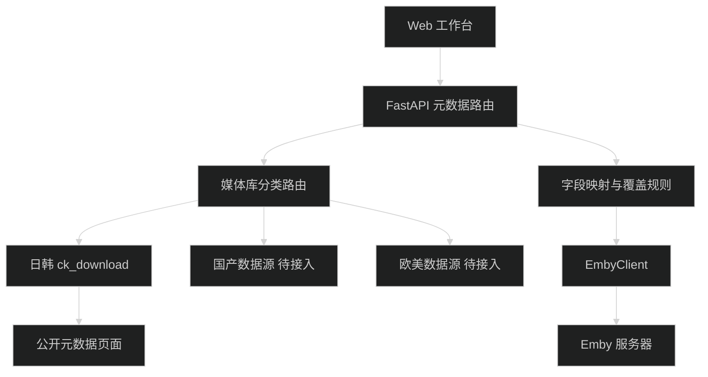

# Emby 元数据补充工作台 Web 页面设计

## 1. 定位与边界

本页面是管理员实际使用的 Emby 元数据工作台，不是营销页。它从新通知数据库加载需要处理的电影，支持批量搜索、候选选择、详情抓取、字段修正和元数据写回。

页面只处理以下数据：`LibraryNewNotificationModel` 中 `type=library.new`、`status=pending_completion`、`item_type=Movie`，且 `payload.Item.Path` 包含“钙片”。列表直接从数据库加载，不要求管理员先搜索。媒体分类固定为国产（`domestic`）、日韩（`japanese_korean`）、欧美（`western`），不同分类不能混用数据源。

`ck-download` 适配器只读取无需登录即可访问的标题、番号、上架日、简介、时长、厂家、标签、DVD 信息和分类标签。不绕过登录或年龄门槛，不保存 Cookie，不下载视频。公开页面没有可确认的产品主图时，候选不显示假封面。

## 2. 核心流程

1. 页面进入后直接查询待处理新通知，不显示搜索输入作为首屏入口。
2. 只保留 `item_type=Movie` 且 `payload.Item.Path` 包含“钙片”的数据，展示 `item_id`、`item_name`、Path、推荐分类、数据源和处理状态。
3. 根据 Path 智能推荐分类：包含“日韩”时默认选择 `japanese_korean` 下的第一个启用数据源；其他路径按分类关键词匹配，无法判断时使用系统默认分类和第一个数据源。
4. 管理员可在每个 Item 上手动修改分类和数据源，然后勾选多个 Item 执行批量搜索。
5. 搜索结果为 1 条时直接抓取详情；多条时以卡片形式展示，管理员选择其中一条后抓取详情。
6. 抓取详情后展示当前 Emby 元数据与候选元数据，允许管理员修改候选字段、图片和角色信息。
7. 确认后写入 Emby，成功更新为“已写入”；失败保留搜索和抓取结果，允许重试。
8. 不需要处理的 Item 可单独或批量删除出队，状态记录为“已删除”。

## 3. 信息架构

- React 左侧栏新增 `Emby 元数据` Tab，进入元数据工作台路由。
- 顶部栏：页面标题、待处理数量、Emby 连接状态、最近一次操作结果。
- 筛选栏：处理状态、分类、数据源、关键词和批量选择操作。
- 待处理列表：`item_id`、`item_name`、Path、推荐分类、数据源、搜索条数、处理状态。
- 批量操作栏：搜索选中 Item、删除不处理 Item、刷新队列。
- 候选区：单个搜索结果自动抓取；多个结果用卡片展示标题、日期、价格、状态、图片和详情操作。
- 详情区：当前元数据与抓取候选字段对比，支持编辑候选值、图片和角色信息。
- 操作记录：搜索条数、抓取来源、归档路径、写入结果和错误摘要，不展示 API Key、Cookie 或完整请求头。

## 4. 桌面布局

当前版本只设计桌面端。采用左侧待处理列表、中央候选卡片、右侧元数据编辑与写回区的三栏布局。首屏优先展示待处理 Item，不使用搜索页作为入口。列表支持多选，候选卡片支持单选，详情区固定显示当前 Item 与选中候选的来源信息。
## 5. 组件与状态

- `EmbyMetadataNavItem`：左侧栏入口，标题为“Emby 元数据”。
- `PendingNotificationList`：查询并展示符合条件的新通知，支持多选和删除出队。
- `MetadataRoutingSelector`：展示 Path 智能匹配的分类和第一个启用数据源，支持手动修改。
- `BatchSearchToolbar`：批量搜索选中 Item，显示进行中数量和失败数量。
- `SearchResultList`：显示每个 Item 的搜索条数和搜索状态。
- `SearchResultCard`：多候选时展示卡片，提供选择和抓取详情操作。
- `CandidateDetailPanel`：展示完整候选元数据和来源信息。
- `MetadataEditor`：允许修改标题、简介、日期、Genres、Studios、People、TagItems 等字段。
- `ImageArchivePanel`：展示封面和角色图的来源、归档路径、下载结果和上传结果。
- `WritebackPanel`：确认写入、显示写入结果并刷新 Item 状态。

状态枚举：

| 状态 | 含义 |
|---|---|
| `待搜索` | 已从新通知队列加载，尚未执行数据源搜索 |
| `搜索中` | 正在请求一个或多个数据源 |
| `已搜索` | 已完成搜索，记录搜索条数 |
| `待选择` | 搜索得到多个候选，等待管理员选择 |
| `抓取中` | 正在请求选中候选的详情页 |
| `已抓取` | 候选详情已加载，可编辑元数据 |
| `写入中` | 正在更新 Emby Item 或图片 |
| `已写入` | 元数据和选定图片已成功写入 Emby |
| `已删除` | 管理员确认不处理，已从工作队列移除 |
| `失败` | 搜索、抓取或写入失败，可查看错误并重试 |
- `SearchResultCarousel`：在当前结果的多张搜索页图片之间切换，不把搜索页图片直接当作 Emby 主封面。
- `CandidateDetailAction`：用户选中结果后才请求详情页，加载完整 `MetadataCandidate`。
- `FieldComparison`：字段级复选框、当前值/候选值对比、差异高亮。
- `ImageArchivePanel`：展示封面和角色图的来源、归档路径、下载结果和上传结果。
- `PersonImageEditor`：逐个角色配置图片，支持来源 URL 预览、上传本地图片和清空自定义图。
- `OverwriteMode`：分段控件，默认“仅填充空字段”，可切换“覆盖已选字段”。
- `ConfirmDialog`：列出 Item、来源、将修改的字段和封面动作。
- `OperationStatus`：加载、空结果、部分字段缺失、成功、失败、页面结构变化、数据源超时。

搜索期间禁用重复提交；搜索响应只解析结果列表，不逐个请求详情；页面显示“共 N 个结果”。每个结果展示搜索页提供的多张图片并支持轮播，同时展示标题、发布日期、价格、状态、`source_id` 和详情链接。用户选中结果并点击“抓取详情”后，才请求并解析该商品详情；详情缺封面时显示“来源未提供公开封面”，不显示占位海报；图片下载必须带来源页 `Referer`，下载成功后先归档到本地，再执行 Emby 图片上传；写回失败时保留用户勾选状态和图片归档结果以便重试。

## 6. 组件与数据流

## 7. 接口草案

- `GET /api/emby/metadata/queue`：从 `LibraryNewNotificationModel` 查询 `type=library.new`、`status=pending_completion`、`item_type=Movie`，并按 `payload.Item.Path` 包含“钙片”过滤。
- `PATCH /api/emby/metadata/queue/{notification_id}/route`：保存管理员手动调整的分类和数据源。
- `POST /api/emby/metadata/queue/search`：批量搜索选中的通知，保存搜索条数和候选结果。
- `GET /api/emby/metadata/queue/{notification_id}/candidates`：返回该 Item 的候选卡片数据。
- `GET /api/emby/metadata/candidates/{source}/{source_id}`：抓取并返回选中候选详情。
- `PATCH /api/emby/metadata/queue/{notification_id}/candidate`：保存管理员修改后的候选元数据。
- `POST /api/emby/metadata/queue/{notification_id}/writeback`：确认写入 Emby 并更新为“已写入”。
- `DELETE /api/emby/metadata/queue/{notification_id}`：删除不需要处理的 Item，更新为“已删除”或移出工作队列。

队列接口返回：`notification_id`、`item_id`、`item_name`、`item_type`、`path`、`category`、`source`、`search_count`、`status`、`candidates`、`candidate`、`error`。
搜索响应应返回 `extracted_product_number`、`category`、`result_count`、轻量 `results` 列表和数据源错误；每个 `result` 包含 `source_id`、`title`、`release_date`、`price_yen`、`statuses`、`image_urls` 和 `detail_url`。搜索接口不请求详情页；用户选中后通过 `GET /api/emby/metadata/candidates/{source}/{source_id}` 获取完整候选。单个数据源失败不伪装为空结果。

## 8. 字段映射与覆盖规则

| 候选字段 | Emby 字段 | 默认选择 | 规则 |
|---|---|---:|---|
| `title` | `Name` | 是 | 仅填空模式不覆盖现有标题 |
| `original_title` | `OriginalTitle` | 否 | 空值不写入 |
| `overview` | `Overview` | 是 | 保留段落换行 |
| `year` | `ProductionYear` | 是 | 优先采用上架日年份 |
| `release_date` | `PremiereDate` | 是 | 使用 ISO 日期 |
| `genres` | `Genres` / `GenreItems` | 是 | 候选内部保存为对象列表；写回时 `Genres` 取名称数组，`GenreItems=[{Name, Id?}]` |
| `studios` | `Studios` | 是 | 厂家映射为工作室对象列表，写回时使用 `[{Name, Id?}]` |
| `people` | `People` | 否 | 角色基础信息写入 Emby，角色图片单独处理 |
| `external_ids` | `ProviderIds` | 是 | 合并键，不删除其他来源 ID |
| `poster_url` | 主封面 | 否 | 下载时必须带来源 `Referer`，成功后先归档再上传 |
| `people[].image_url` | 角色主图 | 否 | 下载时必须带来源 `Referer`，成功后先归档再上传 |
| `people[].image_data/image_path` | 角色主图 | 否 | 管理员自定义上传，优先于来源图片 |
| `tags` | 标签参考 | 否 | 初期展示，不自动写入 |

“覆盖已选字段”为默认模式，优先抓取的数据；“覆盖已选字段”必须显示覆盖警告。空候选值永不清空现有字段。写入前重新读取完整 Item，合并用户勾选字段后提交。

## 9. 安全、授权与版权

- 数据源域名和路径由后端适配器固定，前端不能提交任意 URL，避免 SSRF。
- `source_id` 仅接受纯数字，所有 URL 使用 `urljoin` 组合。
- Emby API Key 只保存在服务端，不返回浏览器，不写日志。
- 写回只允许 POST 且必须二次确认；搜索、详情抓取保持只读。
- 限制并发和访问频率；第一阶段单次搜索只读取一个结果列表，用户选择后才补抓单个详情，默认超时 15 秒，不对搜索结果全量抓取详情。
- `ck-download` 首页条款说明内容仅限私用查看，二次利用需授权。投入正式使用前必须确认抓取、展示及写回用途获得授权，并遵守站点 robots 与频率要求。
- 适配器只获取公开文字元数据；图片下载仅限用户明确执行封面或角色图写回时触发，请求必须带合法来源页 `Referer`，不绕过登录、年龄确认、验证码或付费边界，不下载视频或样片。
- 图片版权独立于文字元数据；无明确公开产品主图或无授权时不抓取、不缓存、不写回，严禁用 logo、banner 或猜测 URL 代替。已归档图片仅用于当前 Emby 写回验证和审计，不对外分发。

## 10. 可访问性

- 所有输入有可见标签，图标按钮提供中文 `aria-label` 和悬浮提示。
- 键盘可完成媒体库选择、候选选择、字段勾选和确认；焦点顺序与页面流程一致。
- 加载和结果使用 `aria-live`；错误信息不只依赖颜色。
- 正文与背景对比度至少 4.5:1，选中态同时使用图标和边框。
- 对话框打开后锁定焦点，关闭后焦点返回触发按钮。

## 11. 页面验收用例

| # | 输入或操作 | 预期结果 |
|---:|---|---|
| 1 | 进入 Emby 元数据 Tab | 直接展示符合数据库条件的待处理 Movie，不要求先搜索 |
| 2 | 新通知 `item_type=Episode` | 不进入队列 |
| 3 | `payload.Item.Path` 不包含“钙片” | 不进入队列 |
| 4 | Path 包含“日韩” | 自动推荐日韩分类下第一个启用数据源 |
| 5 | 自动推荐分类不正确 | 管理员可手动修改分类和数据源 |
| 6 | 多选 Item 执行搜索 | 批量返回每个 Item 的搜索条数和状态 |
| 7 | 搜索返回 1 条 | 自动抓取该候选详情 |
| 8 | 搜索返回多条 | 以卡片展示候选，选择后才抓取详情 |
| 9 | 候选详情抓取完成 | 展示当前值与候选值，管理员可修改后再写入 |
| 10 | ck-download 候选没有公开主图 | 显示“来源未提供公开封面”，不出现假封面和封面写入选项 |
| 11 | 封面下载需要 `Referer` | 下载请求自动带来源页 `Referer`，成功后显示归档路径和上传结果 |
| 12 | 管理员给角色选择本地图片 | 本地图片优先于来源图，归档成功后上传到对应角色 Item |
| 13 | 管理员删除不处理 Item | Item 变为“已删除”，不再出现在待处理列表 |
| 14 | 写入成功 | Item 变为“已写入”，保留写入前后差异和图片结果 |
| 15 | 数据源超时或页面结构变化 | 显示具体错误，不修改 Emby，保留 Item、候选和已归档图片记录 |
