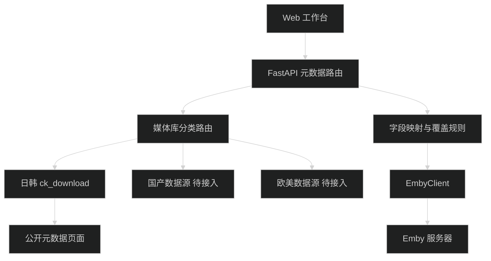

# Emby 元数据补充工作台 Web 页面设计

## 1. 定位与边界

本页面是管理员实际使用的元数据工作台，不是营销页。它帮助用户选择 Emby 媒体条目、搜索分类内数据源、比较字段并确认写回。

媒体库固定映射为三类：国产（`domestic`）、日韩（`japanese_korean`）、欧美（`western`）。路由规则为“媒体库 → 默认分类 → 分类内数据源”，不同分类的数据源不能混用。第一阶段仅接入日韩分类的 `ck_download`。

`ck-download` 适配器只读取无需登录即可访问的标题、番号、上架日、简介、时长、厂家、标签、DVD 信息和分类标签。不绕过登录或年龄门槛，不保存 Cookie，不下载视频。公开页面没有可确认的产品主图时，候选不显示假封面。

## 2. 核心流程

1. 选择媒体库和 Item。
2. 系统从“番号 标题”中优先提取番号；提取失败时使用标题或手动关键词。
3. 根据媒体库默认分类，只调用分类内启用的数据源。
4. 展示按番号精确度、标题相似度排序的候选。
5. 左侧展示 Emby 当前值，右侧展示候选值。
6. 用户逐字段勾选，选择“仅填充空字段”或“覆盖已选字段”。
7. 二次确认后写回，封面写入需单独勾选且来源明确。
8. 图片下载请求按来源站点补齐 `Referer`，成功后先归档到本地，再上传到 Emby。
9. 角色图片既可使用来源图片地址，也可由管理员手工上传本地图片覆盖。

## 3. 信息架构

- 顶部栏：页面标题、Emby 连接状态、最近一次操作结果。
- 左侧筛选栏：媒体库、分类只读提示、Item 搜索、Item 列表与缺失字段状态。
- 主工作区上部：当前 Item、自动提取番号、手动关键词、分类内数据源、搜索按钮。
- 主工作区中部：搜索结果列表，展示结果总数、封面轮播、商品标题、发布日期、价格、状态、详情链接和“抓取详情”操作。
- 主工作区下部：选中结果的详情字段对比表、字段勾选、覆盖模式、确认写回。
- 图片操作区：封面写回开关、封面来源说明、角色图片列表、自定义上传入口、归档状态。
- 操作抽屉：本次请求状态、错误摘要、图片归档结果和最近操作，不展示 API Key、Cookie 或完整外部请求头。

## 4. 布局

### 4.1 桌面端

使用三栏工作布局：左栏 280 px Item 列表，中栏最小 360 px 候选列表，右栏弹性字段对比区。顶部搜索工具栏固定在主工作区，字段对比表支持独立滚动。写回操作固定在右栏底部，避免长简介把按钮推离视口。

### 4.2 移动端

宽度小于 768 px 时改为分步页签：`Item`、`候选`、`字段`。底部固定“上一步/下一步”或“确认写回”操作区。字段对比由三列改为“字段名、当前值、候选值”的纵向块，每个字段保留独立复选框。长标题、简介和外部 ID 自动换行，不横向溢出。

## 5. 组件与状态

- `LibrarySelector`：选择媒体库，显示固定分类；切换后清空旧分类候选。
- `ItemList`：分页、关键词过滤、缺失元数据标记、单选 Item。
- `SearchToolbar`：显示自动番号、可编辑关键词、分类内数据源多选和搜索状态。
- `SearchResultList`：显示搜索结果件数和基础信息；每项包含图片轮播、标题、发布日期、价格、状态、`source_id` 和详情链接。
- `SearchResultCarousel`：在当前结果的多张搜索页图片之间切换，不把搜索页图片直接当作 Emby 主封面。
- `CandidateDetailAction`：用户选中结果后才请求详情页，加载完整 `MetadataCandidate`。
- `FieldComparison`：字段级复选框、当前值/候选值对比、差异高亮。
- `ImageArchivePanel`：展示封面和角色图的来源、归档路径、下载结果和上传结果。
- `PersonImageEditor`：逐个角色配置图片，支持来源 URL 预览、上传本地图片和清空自定义图。
- `OverwriteMode`：分段控件，默认“仅填充空字段”，可切换“覆盖已选字段”。
- `ConfirmDialog`：列出 Item、来源、将修改的字段和封面动作。
- `OperationStatus`：加载、空结果、部分字段缺失、成功、失败、页面结构变化、数据源超时。

搜索期间禁用重复提交；搜索响应只解析结果列表，不逐个请求详情；页面显示“共 N 个结果”。每个结果展示搜索页提供的多张图片并支持轮播，同时展示标题、发布日期、价格、状态、`source_id` 和详情链接。用户选中结果并点击“抓取详情”后，才请求并解析该商品详情；详情缺封面时显示“来源未提供公开封面”，不显示占位海报；图片下载必须带来源页 `Referer`，下载成功后先归档到本地，再执行 Emby 图片上传；写回失败时保留用户勾选状态和图片归档结果以便重试。

## 6. 组件与数据流

## 7. 接口草案

- `GET /api/emby/metadata/libraries`：返回媒体库、默认分类和启用数据源。
- `GET /api/emby/metadata/items?library_id=&query=&page=`：返回 Item 列表。
- `GET /api/emby/metadata/items/{item_id}`：返回完整当前元数据。
- `POST /api/emby/metadata/search`：请求包含 `library_id`、`item_id`、`keyword`、`source_names`；后端依据分类校验数据源。
- `GET /api/emby/metadata/candidates/{source}/{source_id}`：返回候选详情。
- `POST /api/emby/metadata/update/{item_id}`：请求包含字段选择、覆盖模式、候选来源和显式 `confirmed=true`。

搜索响应应返回 `extracted_product_number`、`category`、`result_count`、轻量 `results` 列表和数据源错误；每个 `result` 包含 `source_id`、`title`、`release_date`、`price_yen`、`statuses`、`image_urls` 和 `detail_url`。搜索接口不请求详情页；用户选中后通过 `GET /api/emby/metadata/candidates/{source}/{source_id}` 获取完整候选。单个数据源失败不伪装为空结果。

## 8. 字段映射与覆盖规则

| 候选字段 | Emby 字段 | 默认选择 | 规则 |
|---|---|---:|---|
| `title` | `Name` | 是 | 仅填空模式不覆盖现有标题 |
| `original_title` | `OriginalTitle` | 否 | 空值不写入 |
| `overview` | `Overview` | 是 | 保留段落换行 |
| `year` | `ProductionYear` | 是 | 优先采用上架日年份 |
| `release_date` | `PremiereDate` | 是 | 使用 ISO 日期 |
| `genres` | `Genres` / `GenreItems` | 是 | 候选内部保存为对象列表；写回时 `Genres` 取名称数组，`GenreItems=[{Name, Id?}]` |
| `studios` | `Studios` | 是 | 厂家映射为工作室对象列表，写回时使用 `[{Name, Id?}]` |
| `people` | `People` | 否 | 角色基础信息写入 Emby，角色图片单独处理 |
| `external_ids` | `ProviderIds` | 是 | 合并键，不删除其他来源 ID |
| `poster_url` | 主封面 | 否 | 下载时必须带来源 `Referer`，成功后先归档再上传 |
| `people[].image_url` | 角色主图 | 否 | 下载时必须带来源 `Referer`，成功后先归档再上传 |
| `people[].image_data/image_path` | 角色主图 | 否 | 管理员自定义上传，优先于来源图片 |
| `runtime_minutes` | 时长参考 | 否 | 默认仅展示，不覆盖媒体实际时长 |
| `labels` | 标签参考 | 否 | 初期展示，不自动写入 |

“仅填充空字段”为默认模式；“覆盖已选字段”必须显示覆盖警告。空候选值永不清空现有字段。写入前重新读取完整 Item，合并用户勾选字段后提交。

## 9. 安全、授权与版权

- 数据源域名和路径由后端适配器固定，前端不能提交任意 URL，避免 SSRF。
- `source_id` 仅接受纯数字，所有 URL 使用 `urljoin` 组合。
- Emby API Key 只保存在服务端，不返回浏览器，不写日志。
- 写回只允许 POST 且必须二次确认；搜索、详情抓取保持只读。
- 限制并发和访问频率；第一阶段单次搜索只读取一个结果列表，用户选择后才补抓单个详情，默认超时 15 秒，不对搜索结果全量抓取详情。
- `ck-download` 首页条款说明内容仅限私用查看，二次利用需授权。投入正式使用前必须确认抓取、展示及写回用途获得授权，并遵守站点 robots 与频率要求。
- 适配器只获取公开文字元数据；图片下载仅限用户明确执行封面或角色图写回时触发，请求必须带合法来源页 `Referer`，不绕过登录、年龄确认、验证码或付费边界，不下载视频或样片。
- 图片版权独立于文字元数据；无明确公开产品主图或无授权时不抓取、不缓存、不写回，严禁用 logo、banner 或猜测 URL 代替。已归档图片仅用于当前 Emby 写回验证和审计，不对外分发。

## 10. 可访问性

- 所有输入有可见标签，图标按钮提供中文 `aria-label` 和悬浮提示。
- 键盘可完成媒体库选择、候选选择、字段勾选和确认；焦点顺序与页面流程一致。
- 加载和结果使用 `aria-live`；错误信息不只依赖颜色。
- 正文与背景对比度至少 4.5:1，选中态同时使用图标和边框。
- 对话框打开后锁定焦点，关闭后焦点返回触发按钮。

## 11. 页面验收用例

| # | 输入或操作 | 预期结果 |
|---:|---|---|
| 1 | 选择日韩媒体库和 `CO-ME00059 标题` | 自动提取 `CO-ME00059`，仅展示日韩数据源 |
| 2 | 选择国产媒体库 | 不允许调用 `ck_download`，只显示国产分类数据源或待接入空态 |
| 3 | 选择欧美媒体库 | 不允许调用 `ck_download`，只显示欧美分类数据源或待接入空态 |
| 4 | 标题为 `ABP-123 标题` | 优先使用 `ABP-123` 搜索，候选按精确番号优先排序 |
| 5 | 标题只有普通日文 | 不误识别整个标题为番号，使用原标题搜索并允许手动修改 |
| 6 | 搜索返回多个结果 | 显示“共 N 个结果”，每项展示搜索页图片轮播、标题、日期、价格、状态和详情链接，不请求详情页 |
| 7 | 用户选中一个搜索结果 | 只为选中的 `source_id` 请求详情，显示完整元数据后才能进入字段对比 |
| 8 | 搜索返回重复详情链接 | 按 `source_id` 去重，只显示一次 |
| 9 | ck-download 候选没有公开主图 | 显示“来源未提供公开封面”，不出现假封面和封面写入选项 |
| 10 | 封面下载需要 `Referer` | 下载请求自动带来源页 `Referer`，成功后显示归档路径和上传结果 |
| 11 | 管理员给角色选择本地图片 | 本地图片优先于来源图，归档成功后上传到对应角色 Item |
| 12 | 当前简介已有值且使用仅填空模式 | 简介默认不覆盖，确认清单不包含该字段 |
| 13 | 切换为覆盖模式并勾选年份 | 对话框明确显示旧值、新值，确认后只写入所选字段 |
| 14 | 数据源超时或页面结构变化 | 显示具体错误，不修改 Emby，保留 Item、关键词、字段选择和已归档图片记录 |
