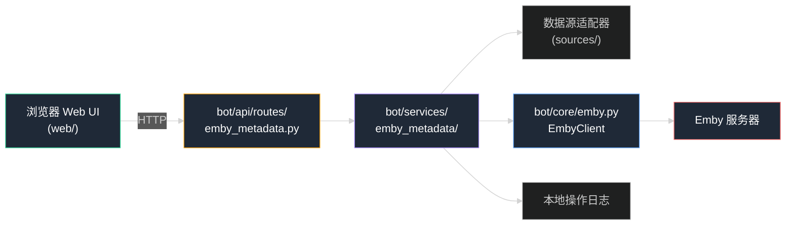

# Emby 影视元数据管理工具设计方案

> 本文已与当前代码架构同步（2026-07-28）。原方案设想的 Flask + 独立 `backend/` 目录已废弃，改为复用项目现有的 FastAPI（`bot/api/`）与服务层（`bot/services/`）。

## 1. 背景与目标

Emby 对部分新影视或特殊发行内容无法自动匹配元数据，需要在网页端手动填写简介、封面、年份等字段。本工具提供一个 Web UI，通过 Emby API 获取电影条目，从可配置的数据源搜索和抓取元数据，经用户确认后写回 Emby。

当前阶段已完成 EmbyClient 元数据更新能力，并进入数据源第一阶段：建立统一候选模型、三类媒体库路由语义和匹配策略，首个实现日韩分类的 `ck-download` 公开元数据搜索与详情解析。HTTP 路由和前端界面仍待实现。

## 2. 目标范围

- 连接公网或局域网 Emby 服务器。
- 获取电影库中的电影和视频条目。
- 支持按标题、编号、文件名或手动输入搜索。
- 支持多数据源，并允许用户选择优先级。
- 展示候选结果、简介、年份、封面和来源。
- 用户确认后更新 Emby 的标题、简介、年份、类型、工作室、外部 ID 和主封面。
- 展示搜索、抓取、更新和失败状态。
- 保留操作日志，便于定位错误和重复处理。

## 3. 暂不纳入范围

- 不自动下载或处理视频文件。
- 不绕过需要登录、验证码或访问控制的数据源。
- 不默认批量覆盖已经有人工元数据的条目。
- 第一阶段以电影为主，不处理剧集、季和单集的复杂层级。
- 不实现云端多用户、账号体系和在线部署。

## 4. 技术方案

### 4.1 架构

复用项目现有的三端结构（`bot/` + `bot/api/` + `web/`），通过 `run_all.py` 统一启动。本功能不另起后端，直接在现有 FastAPI 上扩展。



分层职责：

| 层 | 位置 | 职责 |
|----|------|------|
| HTTP 路由 | `bot/api/routes/emby_metadata.py` | 接收前端请求，编排业务，返回 JSON |
| 抓取业务 | `bot/services/emby_metadata/` | 数据源适配器、匹配策略、候选模型 |
| Emby 调用 | `bot/core/emby.py`（EmbyClient） | 读取条目、更新元数据、上传封面 |
| 配置 | `bot/core/config.py`（settings） | Emby 地址/API Key、数据源白名单 |
| 前端 | `web/src/` | React + shadcn/ui 管理界面 |

### 4.2 技术选型

- 后端：Python + FastAPI（**复用 `bot/api/`，不用 Flask**）。
- HTTP：复用 `bot/utils/http.py` 的 `HttpClient`（EmbyClient 已依赖它）。
- HTML 解析：BeautifulSoup4，仅处理允许访问的公开页面。
- 前端：React + shadcn/ui（当前阶段只确定技术栈，不实现前端）。
- 配置：复用 `bot/core/config.py` 的 `settings`，从根 `.env` 加载。API Key 只在 `.env`，`.env.example` 仅模板。
- 日志：复用 `loguru`，按时间记录到本地日志文件。

## 5. 核心模块

### 5.1 Emby 客户端（`bot/core/emby.py`）

复用现有 `EmbyClient`，按需补全以下能力：

| 能力 | 方法 | Emby 端点 | 现状 |
|------|------|-----------|------|
| 测试连接 | `get_system_info()` | `GET /System/Info` | 待补 |
| 获取用户列表 | `get_users()` | `GET /Users/Query` | 已有 |
| 获取电影列表 | `get_items(ids, user_id=...)` | `GET /Items` | 已有 |
| 获取完整条目 | `get_item(user_id, item_id)` | `GET /Users/{UserId}/Items/{Id}` | 已有 |
| 更新元数据 | `update_item(item_id, item_data)` | `POST /Items/{ItemId}` | 待补 |
| 上传 Item 封面 | `upload_item_image(item_id, image_data, image_type)` | `POST /Items/{ItemId}/Images/{Type}` | 待补 |
| 上传用户头像 | `upload_user_image(...)` | `POST /Users/{Id}/Images/{Type}` | 已有（非本功能用） |

更新前必须先读取完整 DTO，尽量只修改明确需要更新的字段，避免覆盖 Emby 内部字段。

### 5.2 数据源适配器（`bot/services/emby_metadata/sources/`）

统一输出内部元数据模型 `MetadataCandidate`（pydantic）：

```text
MetadataCandidate
- source
- source_id
- title
- original_title
- overview
- year
- release_date
- genres
- studios
- people
- external_ids
- poster_url
- confidence
- raw_url
```

每个数据源独立实现搜索和详情解析，不能让 Web 层依赖具体网站 HTML 结构。媒体库固定映射为国产（`domestic`）、日韩（`japanese_korean`）、欧美（`western`），按“媒体库 → 默认分类 → 分类内数据源”路由，禁止跨分类调用。首个适配器 `ck_download` 属于日韩分类，只读取公开元数据。数据源访问应设置超时、请求间隔和错误日志，并遵守目标站点的使用条款。

### 5.3 匹配策略（`bot/services/emby_metadata/matching.py`）

默认按以下顺序尝试：

1. 从 Emby Item 的“番号 标题”中提取番号并优先搜索，如 `CO-ME00059`、`CO-ME-00059`、`ABP-123`、`No.059`。
2. 没有番号时使用清理后的文件名或 Emby 标题。
3. 标题。
4. 多个候选先按规范化番号精确匹配，再以标题相似度辅助排序。

低置信度结果只展示，不自动写入。用户必须在 Web UI 中确认。

### 5.4 Web UI（`web/src/`，后续阶段）

页面分四区：连接配置 / 电影列表 / 元数据搜索 / 预览与更新。必须提供加载中、空结果、错误、成功、失败状态。

## 6. 更新规则

默认只更新用户勾选的字段：标题、原标题、简介、首映日期和年份、类型、制作公司或工作室、外部 ID、主封面。

对已存在字段，UI 显示覆盖警告。提供"仅填充空字段"和"覆盖已选字段"两种模式，默认前者。

## 7. 配置与安全

- Emby API Key 只在 `.env`，`.env.example` 仅模板。
- Web 服务默认绑定 `127.0.0.1`；公网用需 VPN / 反向代理 / 访问控制。
- 不在日志记录 API Key、Cookie 或完整敏感请求头。
- 对外部 URL 用白名单或数据源适配器限制，防 SSRF。
- 更新接口带确认参数，不能仅凭 GET 触发写入。

## 8. 错误处理

区分：Emby 地址不可达 / API Key 无效或权限不足 / 数据源超时或限流或页面结构变化 / 搜索无结果 / 图片下载失败 / Emby 更新失败。每次操作返回可读错误信息，并记录时间、条目 ID、数据源、操作类型、错误摘要。

## 9. 验证方案

至少覆盖 10 类输入：正常唯一匹配 / 标题带年份 / 文件名含技术信息 / 空标题 / 无结果 / 多候选 / 已有元数据不默认覆盖 / 按选择覆盖 / API Key 错误 / 图片下载或更新失败。

## 10. 实施顺序

1. **补全 EmbyClient 元数据更新能力**（`get_system_info` / `update_item` / `upload_item_image`）。
2. 真实 Emby 联调：读取电影列表、完整条目、写回单条。
3. 定义 `MetadataCandidate` 内部模型与数据源适配器接口。
4. 实现第一个数据源适配器（基于已调研站点）。
5. 实现候选搜索与详情预览。
6. 实现字段级更新和封面上传。
7. 增加日志、错误状态和测试。
8. 启动本地服务并做真实 Emby 小范围验证。

## 11. 已确认的调研信息

- 目标环境为 Windows。
- 用户希望有 Web UI，支持输入、选择数据源和展示状态。
- 目前以电影为主。
- Emby 可通过公网地址访问。
- 首个数据源为日韩分类的 `www.ck-download.com`。公开搜索端点为 `GET /product/search?kw=<keyword>&only_nm=0&kw_opt=1`，详情页为 `/product/detail/{numeric_id}`；当前解析标题、番号、上架日、简介、时长、厂家、标签和 DVD 信息。公开页没有明确产品主图时 `poster_url=None`，不猜测图片 URL。
- 站点条款明确内容仅限私用查看，二次利用需授权。适配器不绕过登录或年龄门槛，不下载图片或视频；正式使用前仍需确认授权、robots、访问频率和页面稳定性。

## 12. 架构变更记录

| 日期 | 变更 |
|------|------|
| 2026-07-28 | 废弃 Flask + 独立 `backend/` 方案，改为复用现有 FastAPI（`bot/api/`）+ 服务层（`bot/services/emby_metadata/`）；分层职责表更新；EmbyClient 能力清单与现状对齐 |
| 2026-07-30 | 数据源第一阶段改为日韩 `ck-download`；加入国产/日韩/欧美三分类路由、番号优先搜索策略、公开访问与图片版权边界；模型、匹配、搜索和详情解析已实现 |
