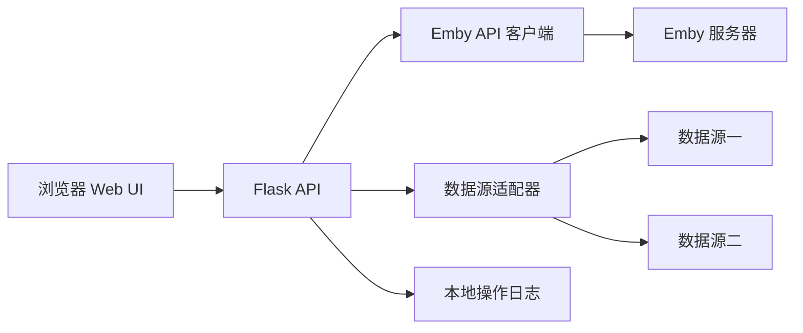

# Emby 影视元数据管理工具设计方案

## 1. 背景与目标

Emby 对部分新影视或特殊发行内容无法自动匹配元数据，需要在网页端手动填写简介、封面、年份等字段。本工具计划提供一个本地 Web UI，通过 Emby API 获取电影条目，从可配置的数据源搜索和抓取元数据，经过用户确认后写回 Emby。

当前阶段先实现后端基础能力：连接 Emby、读取 Item，并提供内置模拟 Item 用于联调。数据源搜索、页面抓取和前端界面暂不实现。

## 2. 目标范围

- 连接公网或局域网 Emby 服务器。
- 获取电影库中的电影和视频条目。
- 支持按标题、编号、文件名或手动输入搜索。
- 支持多数据源，并允许用户选择优先级。
- 展示候选结果、简介、年份、封面和来源。
- 用户确认后更新 Emby 的标题、简介、年份、类型、工作室、外部 ID 和主封面。
- 展示搜索、抓取、更新和失败状态。
- 保留操作日志，便于定位错误和重复处理。

## 3. 暂不纳入范围

- 不自动下载或处理视频文件。
- 不绕过需要登录、验证码或访问控制的数据源。
- 不默认批量覆盖已经有人工元数据的条目。
- 第一阶段以电影为主，不处理剧集、季和单集的复杂层级。
- 不实现云端多用户、账号体系和在线部署。

## 4. 推荐技术方案

### 4.1 架构

采用单体 Web 应用，运行在用户自己的 Windows 机器或服务器上。当前阶段只实现后端 API，前端后续使用 React + shadcn/ui：



### 4.2 技术选型

- 后端：Python + Flask。
- HTTP：requests。
- HTML 解析：BeautifulSoup4，仅处理允许访问的公开页面。
- 前端：React + shadcn/ui（当前阶段只确定技术栈，不实现前端）。
- 配置：`backend/.env`，通过 `python-dotenv` 加载。API Key 只保存在本地 `.env`，`backend/.env.example` 仅提供配置模板，不填写真实密钥。
- 日志：按时间记录到本地日志文件或 SQLite。

## 5. 核心模块

### 5.1 Emby 客户端

封装以下能力：

- 测试连接：`/System/Info`。
- 获取用户或管理员 ID：`/Users`。
- 获取电影列表：`/Users/{UserId}/Items`。
- 获取完整条目：`/Users/{UserId}/Items/{ItemId}`。
- 更新元数据：`POST /Items/{ItemId}`。
- 上传主封面：`POST /Items/{ItemId}/Images/Primary`。

更新前必须先读取完整 DTO，尽量只修改明确需要更新的字段，避免覆盖 Emby 内部字段。

### 5.2 数据源适配器

统一输出内部元数据模型：

```text
MetadataCandidate
- source
- source_id
- title
- original_title
- overview
- year
- release_date
- genres
- studios
- people
- external_ids
- poster_url
- confidence
- raw_url
```

每个数据源独立实现搜索和详情解析，不能让 Web 层依赖具体网站 HTML 结构。数据源访问应设置超时、请求间隔和错误日志，并遵守目标站点的使用条款。

### 5.3 匹配策略

默认按以下顺序尝试：

1. 用户输入的明确编号或外部 ID。
2. 清理后的文件名或 Emby 标题。
3. 标题 + 年份。
4. 多个候选按标题相似度和年份一致性排序。

低置信度结果只展示，不自动写入。用户必须在 Web UI 中确认。

### 5.4 Web UI

页面分为四个区域：

- 连接配置：Emby 地址、API Key、测试连接。
- 电影列表：显示标题、年份、是否有简介、是否有封面、最后处理状态。
- 元数据搜索：选择数据源、输入关键词、查看候选结果。
- 预览与更新：对比 Emby 当前值和候选值，逐字段选择后更新。

必须提供：加载中状态、空结果状态、错误状态、更新成功状态和更新失败原因。

## 6. 更新规则

默认只更新用户勾选的字段：

- 标题。
- 原标题。
- 简介。
- 首映日期和年份。
- 类型。
- 制作公司或工作室。
- 外部 ID。
- 主封面。

对于已经存在的字段，UI 显示覆盖警告。建议提供“仅填充空字段”和“覆盖已选字段”两种模式，默认使用前者。

## 7. 配置与安全

- Emby API Key 只保存在服务端配置中。
- Web 服务默认绑定 `127.0.0.1`，需要公网使用时建议通过 VPN、反向代理或访问控制保护。
- 不在日志中记录 API Key、Cookie 或完整敏感请求头。
- 对外部 URL 使用白名单或数据源适配器限制，避免任意 URL 请求。
- 更新接口增加确认参数，不能仅凭 GET 请求触发写入。

## 8. 错误处理

需要区分：

- Emby 地址不可达。
- API Key 无效或权限不足。
- 数据源超时、限流或页面结构变化。
- 搜索无结果。
- 图片下载失败。
- Emby 更新失败。

每次操作返回可读错误信息，同时记录时间、条目 ID、数据源、操作类型和错误摘要。

## 9. 验证方案

至少覆盖以下 10 类输入：

1. 正常标题且数据源有唯一结果：展示正确候选并成功更新。
2. 标题带年份：去除年份后仍能搜索。
3. 文件名包含分辨率和编码信息：清理后正常匹配。
4. 标题为空：提示用户手动输入。
5. 数据源无结果：显示空结果，不修改 Emby。
6. 多个候选：按置信度排序，要求人工确认。
7. 已有简介和封面：默认不覆盖。
8. 用户勾选覆盖：只更新勾选字段。
9. Emby API Key 错误：连接测试失败并给出原因。
10. 图片下载或 Emby 更新失败：保留错误状态，不显示虚假的成功。

## 10. 实施顺序

1. 确定数据源和合法访问方式。
2. 实现配置与 Emby 连接测试。
3. 实现电影列表读取。
4. 定义元数据内部模型和第一个数据源适配器。
5. 实现候选搜索与详情预览。
6. 实现字段级更新和封面上传。
7. 增加日志、错误状态和测试。
8. 启动本地服务并进行真实 Emby 小范围验证。

## 11. 已确认的调研信息

- 目标环境为 Windows。
- 用户希望有 Web UI，支持输入、选择数据源和展示状态。
- 目前以电影为主。
- Emby 可通过公网地址访问。
- `hunk-ch.com` 页面存在搜索接口 `search.php?s=...` 和详情页 `movie_detail.php?code=...`，详情页包含标题、简介、品牌、发行日期、时长、分类及图片链接。正式实施前仍需确认授权、访问条款和页面稳定性。
