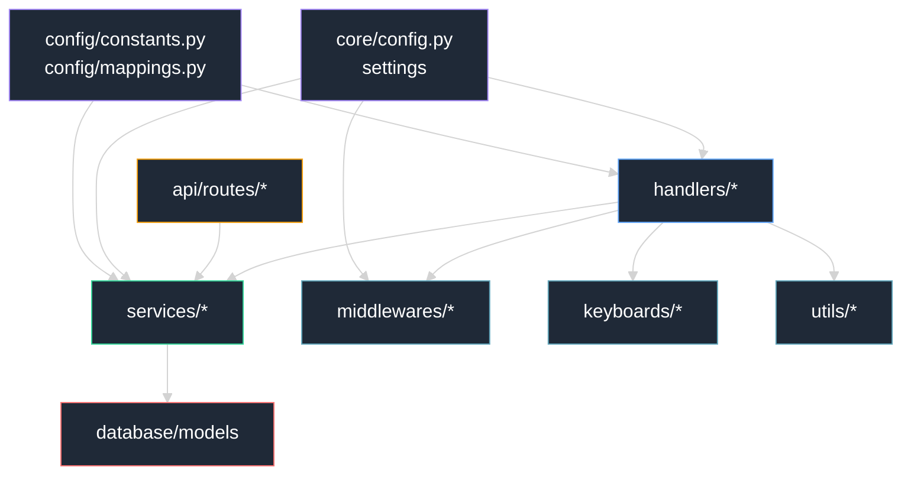
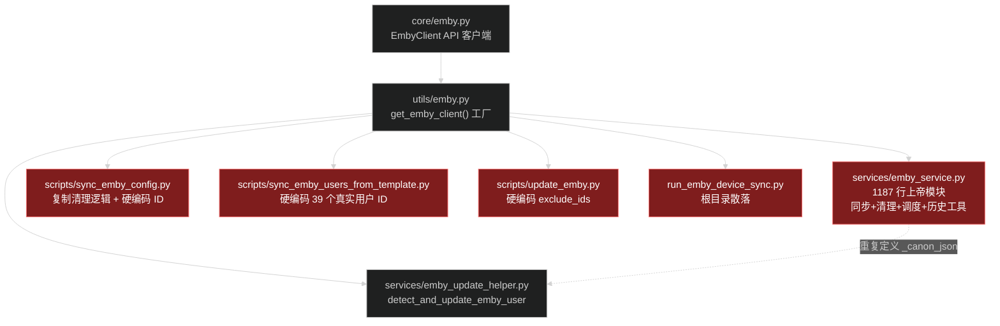

# 项目结构与命名治理分析

> 基于 `bot/`、`web/`、`scripts/`、`docs/`、根目录的实际文件梳理。
> 用于定位"文件夹位置 / 命名"层面的不合理之处，并给出优化建议。
> 与 `docs/project-structure.md`（结构总览）互补：那份讲"是什么"，本文讲"哪里不好、怎么改"。

---

## 一、当前结构概览（精简树）

```text
telegram-bot-template-donBarbos/
├─ bot/                        # 机器人主代码（Python 包）
│  ├─ analytics/               # 分析上报
│  ├─ api/                     # FastAPI 后端（routes/）
│  ├─ assets/                  # 包内静态资源（fonts / redpacket）
│  ├─ cache/                   # 缓存实现
│  ├─ config/                  # DB 功能开关常量 / 映射
│  ├─ core/                    # env 配置 / loader / EmbyClient
│  ├─ database/                # ORM 模型 + 迁移(遗留)
│  ├─ filters/                 # aiogram Filter
│  ├─ handlers/                # Telegram 交互层
│  │  ├─ command/{user,admin,owner,test}/   # 斜杠命令
│  │  ├─ admin/  user/  group/  owner/       # 回调/菜单/交互
│  │  └─ start.py
│  ├─ keyboards/               # inline / reply
│  ├─ middlewares/             # aiogram 中间件
│  ├─ runtime/                 # 启停钩子
│  ├─ services/                # 业务逻辑
│  ├─ states/                  # FSM 状态（无 __init__.py）
│  ├─ tests/                   # 测试/调试
│  ├─ tools/                   # 开发辅助脚本
│  └─ utils/                   # 运行时工具函数
├─ web/                        # React 前端
├─ docs/                       # 设计与说明文档
├─ scripts/                    # 运维/同步脚本
├─ migrations/                 # Alembic 迁移（真·生效）
├─ assets/                     # 根级静态资源（fonts 与 bot/assets 重复）
├─ test_emby_api.py            # 散落根目录的调试脚本
├─ test_series_notification.py # 散落根目录的调试脚本
├─ run_emby_device_sync.py     # 散落根目录的同步入口
├─ run_all.py                  # 统一启动入口
└─ emby_test_commands.md       # 散落根目录的文档
```

分层依赖关系：



---

## 二、问题清单（按严重度分级）

| 级别 | 问题 | 位置 |
|------|------|------|
| P0 | Emby 逻辑跨 5 层分散 + 上帝模块 + 重复代码 | core/utils/services/scripts/根目录 |
| P0 | `handlers/command/test/` 违反三级权限规则且生产加载 | handlers/command/test/ |
| P0 | 两套 migration 目录，`bot/database/migrations/` 是孤儿 | bot/database/migrations/ |
| P1 | 两个 `constants.py` 同名不同义 | core/constants.py vs config/constants.py |
| P1 | `bot/core/` 与 `bot/config/` 都管"配置"边界模糊 | core/ vs config/ |
| P1 | handlers 双层结构 + 同名跨层（submission_review） | handlers/admin vs handlers/command/admin |
| P1 | 根目录散落 5 个调试/启动文件，部分引用不存在符号 | 根目录 |
| P2 | `assets/fonts/` 与 `bot/assets/fonts/` 6 字体重复 | assets/ vs bot/assets/ |
| P2 | `bot/states/` 无 `__init__.py`，风格不一致 | bot/states/ |
| P2 | `tools/generate_feature.py` 生成的代码引用不存在的包 | bot/tools/ |
| P2 | `emby_template_sync.py` 误归类于 tools | bot/tools/ |
| P2 | `quiz.py` / `quizs.py` 仅靠 s 复数区分单/批量 | handlers/command/admin/ |

---

## 三、详细问题分析

### 3.1 P0：Emby 逻辑分散 + 上帝模块 + 重复代码

**分散层级**：



**核心问题**：

1. **上帝模块**：`bot/services/emby_service.py` 长达 1187 行，混入 6 类职责：
   - 用户同步（`save_all_emby_users`）
   - 设备同步（`save_all_emby_devices`）
   - Policy 清理（`cleanup_devices_by_policy`）
   - 用户创建（`create_user`）
   - 调度器（`start_scheduler`）
   - 设备历史快照工具（`build_device_snapshot` / `build_device_diff` / `create_device_history`）
2. **重复代码**：`_canon_json` 在 `emby_service.py`（约 601 行）与 `emby_update_helper.py`（11 行）各定义一份，完全相同。
3. **脚本复制业务逻辑**：`scripts/sync_emby_config.py` 重新实现了一遍 `len(devices) < max_devices` 三分支清理，与 `emby_service.cleanup_devices_by_policy` 重复。
4. **硬编码用户 ID**：`scripts/sync_emby_users_from_template.py` 把 39 个真实 Emby 用户 ID 写死在源码；`sync_emby_config.py`、`update_emby.py` 也写死 `exclude_ids`。应外置到配置/参数。
5. **根目录散落**：`run_emby_device_sync.py` 本质是脚本，却放在项目根目录。

### 3.2 P0：`handlers/command/test/` 违反权限规则

`.trae/rules/aiogram-command-meta.md` 规定**只允许** `user / admin / owner` 三级目录，但 `bot/handlers/command/test/` 是第 4 级。

- 目录下仅 `dynamic_redpacket_preview.py`（`/test_rp` 命令）。
- **没有 `__init__.py`**（与三级目录不一致）。
- 被 `bot/handlers/command/__init__.py` 第 7 行**硬编码引入**，注释明说"临时开启、无需 DEBUG 模式"——即生产环境也会加载测试命令，既是规则违反也是潜在质量隐患。

### 3.3 P0：两套 migration 目录，`bot/database/migrations/` 是孤儿

| 位置 | 是否接入 Alembic | 证据 |
|------|----------------|------|
| `migrations/`（根） | 是 | `alembic.ini` 的 `script_location = migrations`，`env.py` 用 `bot.database.models.Base.metadata` |
| `bot/database/migrations/` | 否 | 无 `env.py` / `script.py.mako` / `README`；grep `bot.database.migrations` **零引用** |

`bot/database/migrations/versions/` 里有 5 个中文命名版本文件（如 `2025-12-20_调整notification表字段顺序v2.py`），是早期遗留，Alembic 不会扫描。应整体删除。

### 3.4 P1：两个 `constants.py` 同名不同义

| 文件 | 内容 | 证据 |
|------|------|------|
| `bot/core/constants.py` | 业务值常量 | `CURRENCY_NAME = "精粹"`、`EVENT_TYPE_LIBRARY_NEW = "library.new"` |
| `bot/config/constants.py` | DB 键名字符串 | `KEY_USER_PROFILE = "user.profile"`、`KEY_ADMIN_QUIZ = "admin.quiz"` |

两者完全不同，但同名极易混淆。且 `bot/core/` 与 `bot/config/` 都在管"配置"——实际边界是「env 配置 vs DB 功能开关」，目录名没有体现。

### 3.5 P1：handlers 双层结构 + 同名跨层

项目对 admin/user/owner 三类角色都做了双层：

| 层 | 目录 | 触发 | 加载 |
|----|------|------|------|
| 菜单/回调 | `handlers/<role>/` | CallbackQuery | 静态 include |
| 命令 | `handlers/command/<role>/` | Message+Command | 动态 pkgutil |

双层职责本身清晰，但**同领域同名文件跨层**造成误判风险：

- `handlers/admin/notification/submission_review.py`（UI：列表渲染）
- `handlers/command/admin/submission_review.py`（命令 `/sr`：执行通过/拒绝）

两者不重复、是互补，但同名跨层容易误判。

### 3.6 P1：根目录散落文件

| 文件 | 实质 | 问题 |
|------|------|------|
| `test_emby_api.py` | 调试样例 | 调用了不存在的 `emby_client.close()` |
| `test_series_notification.py` | 调试样例 | 调用了 `EmbyClient` 不存在的 `get_series_info` |
| `emby_test_commands.md` | 测试文档 | 引用了不存在的 `EMBY_ADMIN_ID`、`test_emby_quick.py` |
| `run_emby_device_sync.py` | 同步脚本 | 应归 `scripts/` |
| `run_all.py` | 统一入口 | 可保留根或归 `scripts/` |

前三个引用了不存在的符号，属遗留调试垃圾。

### 3.7 P2：其他问题

- **assets 重复**：根 `assets/fonts/` 与 `bot/assets/fonts/` 完全相同的 6 个字体文件并存。应保留包内 `bot/assets/fonts/`（便于打包），删除根 `assets/fonts/` 重复项。
- **states 无 `__init__.py`**：`bot/states/` 用隐式命名空间包，全项目其他目录都显式 `__init__.py`，风格不一致。且状态定义双轨：中央 `bot/states/{admin,user}.py` 与本地 `handlers/admin/notification/states.py`。
- **tools 陈旧**：`bot/tools/generate_feature.py` 生成的代码引用不存在的 `bot.features` 包、`keyboards.inline.common_buttons.get_back_button`，已与真实结构脱节。
- **tools 误归类**：`bot/tools/emby_template_sync.py` 的 `sync_users_from_template` 是运行期批量操作（被 scripts 运行时调用），不是开发辅助，语义上更接近 `services/emby_service.py`。
- **命令命名**：`quiz.py`（单条 `/q`）与 `quizs.py`（批量 `/qs`）仅靠 `s` 复数区分，语义不直观，建议 `quiz_single.py` / `quiz_batch.py`。

---

## 四、优化建议（按优先级）

### P0 — 必须治理

1. **Emby 重构**：
   - 拆分 `emby_service.py`（1187 行）为：
     - `services/emby/user_sync.py`（用户同步）
     - `services/emby/device_sync.py`（设备同步）
     - `services/emby/policy.py`（Policy 清理）
     - `services/emby/history.py`（设备历史快照工具）
     - `services/emby/scheduler.py`（调度器）
   - 删除重复的 `_canon_json`，统一到一处。
   - 把 scripts 里复制的清理逻辑改为调用 service 函数。
   - 硬编码的用户 ID / exclude_ids 外置到 `.env` 或 CLI 参数。
   - `run_emby_device_sync.py` 移到 `scripts/`。

2. **`handlers/command/test/` 处置**：
   - 删除该目录与 `__init__.py` 中的硬编码 include；或
   - 若确需保留测试命令，用 `if settings.debug` 包裹，且目录改名为 `debug/` 并加 `__init__.py`（但仍违反三级规则，更推荐彻底移除，改放 `bot/tests/`）。

3. **删除孤儿 migration 目录**：
   - 删除整个 `bot/database/migrations/`。
   - 如有需要保留的变更，重新生成到根 `migrations/versions/` 并用规范命名（`YYYY-MM-DD_HHMM_<short_slug>.py`，全英文）。

### P1 — 建议治理

4. **配置层重命名**：
   - `bot/core/constants.py` → `bot/core/business_constants.py`（或并入 `core/enum.py`）。
   - `bot/config/` → `bot/features/`（语义：DB 功能开关），避免与 `core/` 混淆。
   - 去掉 `bot/config/__init__.py` 的 `*` re-export，改为显式 import。

5. **handlers 跨层同名**：
   - `handlers/admin/notification/submission_review.py` → `submission_review_ui.py`
   - `handlers/command/admin/submission_review.py` → `submission_review_cmd.py`
   - 统一约定：UI 侧用 `_ui` 后缀，命令侧用 `_cmd` 后缀。

6. **根目录清理**：
   - `test_emby_api.py`、`test_series_notification.py` → 删除或移到 `bot/tests/`（修复不存在的符号引用，或直接删）。
   - `emby_test_commands.md` → 移到 `docs/` 或删除。
   - `run_emby_device_sync.py` → 移到 `scripts/`。

### P2 — 可选治理

7. **assets 去重**：删除根 `assets/fonts/` 的 6 个重复字体，仅保留 `bot/assets/fonts/`。
8. **states 补 `__init__.py`**：与其他目录风格一致；明确约定状态集中定义 vs 本地定义的边界。
9. **tools 清理**：
   - 删除/重写 `generate_feature.py`（生成的代码已不可运行）。
   - `emby_template_sync.py` 移到 `services/emby/` 下（与 Emby 重构一并处理）。
10. **命令命名**：`quiz.py`/`quizs.py` → `quiz_single.py`/`quiz_batch.py`。

---

## 五、推荐目录结构调整

仅标注**需要变动**的部分：

```text
bot/
├─ core/
│  ├─ config.py                  # 保留（env 配置）
│  ├─ business_constants.py      # ← 原 constants.py（业务值）
│  ├─ emby.py                    # 保留（API 客户端）
│  └─ loader.py
├─ features/                     # ← 原 config/（DB 功能开关）
│  ├─ constants.py               # KEY_* 键名
│  └─ mappings.py               # DEFAULT_CONFIGS / *_FEATURES_MAPPING
├─ services/
│  └─ emby/                      # ← 拆分 emby_service.py
│     ├─ user_sync.py
│     ├─ device_sync.py
│     ├─ policy.py
│     ├─ history.py
│     └─ scheduler.py
├─ handlers/
│  └─ command/
│     ├─ user/  admin/  owner/    # 仅三级，删除 test/
│     ├─ admin/quiz_single.py    # ← 原 quiz.py
│     └─ admin/quiz_batch.py     # ← 原 quizs.py
├─ states/
│  └─ __init__.py                # ← 新增（风格一致）
└─ tools/                         # 仅保留纯开发期工具
   └─ generate_feature.py         # 重写或删除

migrations/                       # 唯一 Alembic 目录（已生效）
scripts/
├─ run_emby_device_sync.py       # ← 从根目录移入
└─ ...                           # 硬编码 ID 外置到 .env

# 删除：
# - bot/database/migrations/      （孤儿）
# - assets/fonts/                 （与 bot/assets/fonts 重复）
# - 根目录 test_*.py / emby_test_commands.md
```

---

## 六、不建议改动的部分

以下组织良好，保持现状：

- `bot/handlers/user/submission_{menu,my,request,submit}.py` 的按子流程拆分（仅 `submission.py` 建议改 `submission_menu.py` 对称命名）。
- `bot/filters/`、`bot/keyboards/`、`bot/middlewares/` 的分层。
- `bot/database/models/` 按领域拆分（`emby_*.py`、`currency_*.py` 聚类清晰）。
- `bot/api/routes/` 按模块拆分。
- `web/src/` 的 React 分层（components / layout / assets）。

---

## 七、落地顺序建议

1. **清理冗余**（低风险）：删孤儿 migration、删重复字体、清根目录散落文件 → 立即可做。
2. **配置层重命名**（中风险）：`constants.py` 重命名、`config/` → `features/` → 需全局替换 import。
3. **Emby 重构**（高风险）：拆分上帝模块、统一重复代码、scripts 调用 service → 影响面大，建议单独立项并补测试。
4. **handlers 治理**（中风险）：删 test/、跨层同名加后缀。
5. **细节**：states 加 `__init__.py`、命令文件改名。
