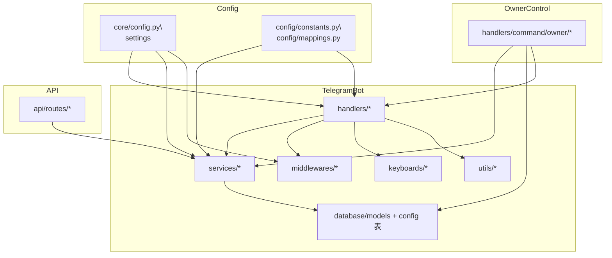

# 项目结构总览（给 GPT 用）

本项目是基于 **Aiogram 3** 的 Telegram Bot，采用分层架构：

- `handlers/`：处理 Telegram 更新（命令、按钮、消息）
- `services/`：业务逻辑
- `database/`：数据库模型与迁移
- `utils/`：通用工具
- `api/`：HTTP / 管理 API
- `config` & `core`：配置与全局对象

---

## 根目录

```text
telegram-bot-template-donBarbos/
├─ bot/                # 机器人主代码
├─ docs/               # 设计与说明文档
├─ assets/             # 图片、banner 等静态资源
├─ .trae/              # Trae 规则与说明
├─ .github/            # GitHub Actions 工作流
├─ Dockerfile          # Docker 构建配置
├─ docker-compose.yml  # Docker 编排
├─ README.md           # 项目说明
└─ alembic.ini         # Alembic 迁移配置
```

---

## bot 目录结构

```text
bot/
├─ __main__.py         # Bot 启动入口（python -m bot）
├─ analytics/          # 分析上报（如 Google Analytics）
├─ api/                # 内置 API（FastAPI）
├─ cache/              # 缓存实现
├─ config/             # 配置常量与功能映射
├─ core/               # 全局 settings、loader、核心常量
├─ database/           # ORM 模型与迁移脚本
├─ filters/            # Aiogram Filter 扩展
├─ handlers/           # Telegram 交互层（命令、面板）
├─ keyboards/          # Inline/Reply 键盘
├─ middlewares/        # Aiogram 中间件
├─ runtime/            # 启动/关闭钩子
├─ services/           # 业务服务层
├─ states/             # FSM 状态
├─ tests/              # 测试与调试工具
├─ tools/              # 开发辅助脚本
└─ utils/              # 通用工具函数
```

---

## config 与 core

- `bot/config/constants.py`  
  定义所有配置键名（字符串），例如：
  - `KEY_USER_FEATURES_ENABLED`
  - `KEY_ADMIN_FEATURES_ENABLED`
  - `KEY_USER_COMMANDS_DISABLED`
  - `KEY_ADMIN_COMMANDS_DISABLED`

- `bot/config/mappings.py`  
  - `DEFAULT_CONFIGS`：配置默认值与类型  
  - `USER_FEATURES_MAPPING`：用户功能开关映射  
  - `ADMIN_FEATURES_MAPPING`：管理员功能开关映射  

- `bot/core/config.py`  
  - `settings`：从环境变量加载的全局配置（owner/admin ID、数据库 URL 等）

- `bot/core/loader.py`  
  - 创建 Bot、Dispatcher 等核心对象

---

## database 层

目录：`bot/database/`

- `models/`：所有 ORM 模型，例如：
  - `user.py` / `user_extend.py`：用户数据与角色
  - `config.py`：`ConfigModel`，存储配置键值
  - `group_config.py`：群组消息保存配置
  - `media_file.py`：媒体文件唯一名与文件 ID
  - `notification.py` / `library_new_notification.py`：通知系统
  - `quiz.py`：问答系统
  - `currency_*.py`：虚拟货币系统

- `database.py`：创建 AsyncSession 与 engine  
- `migrations/versions/`：Alembic 迁移脚本  

---

## services（业务逻辑）

目录：`bot/services/`

核心服务：

- `config_service.py`
  - 读取/写入配置表：`get_config` / `set_config` / `toggle_config`
  - 功能开关：`list_user_features` / `list_admin_features`
  - 命令权限控制：
    - `get_disabled_commands(scope)`
    - `set_disabled_commands(scope, values)`
    - `is_command_enabled(scope, name)`
    - `toggle_command_access(scope, name)`

- `admin_service.py`：封禁/解封 Emby 用户等管理员操作  
- `users.py`：用户相关业务（判断是否为 admin 等）  
- `group_config_service.py`：群组配置业务逻辑  
- `emby_service.py`：Emby 数据同步  
- `quiz_service.py`：问答系统流程  
- `main_message.py`：主消息面板更新  
- `message_export.py`：消息导出  
- `currency.py`：货币增减与流水记录  

---

## utils（通用工具）

目录：`bot/utils/`

关键模块：

- `permissions.py`
  - 解析用户角色：owner / admin / user
  - 权限装饰器：
    - `require_owner`
    - `require_admin_priv`
    - `require_admin_feature`
    - `require_user_feature`
    - `require_user_command_access` / `require_admin_command_access`

- `decorators.py`：如 `private_chat_only` 等通用装饰器  
- `datetime.py`：时间与时区工具  
- `message.py`：消息与 toast 发送封装  
- `text.py`：MarkdownV2 转义等文本工具  
- 其他：`security.py`、`images.py`、`submission.py` 等为具体业务提供小工具  

---

## handlers（Telegram 交互层）

顶层结构：

```text
bot/handlers/
├─ command/    # 纯斜杠命令（按权限分类）
├─ admin/      # 管理员面板与图形化菜单
├─ user/       # 普通用户交互（注册、资料、商店、投稿等）
├─ group/      # 群组消息与成员事件
├─ owner/      # owner 配置面板
└─ start.py    # /start 入口逻辑
```

### command 子目录

```text
bot/handlers/command/
├─ _meta.py        # 命令元数据扫描工具
├─ __init__.py     # 聚合所有命令 router
├─ user/           # 用户权限命令
├─ admin/          # 管理员权限命令
└─ owner/          # 所有者命令
```

- `command/_meta.py`
  - `collect_command_meta(package)`：扫描模块的 `COMMAND_META`
  - `collect_command_names(package)`：提取命令名列表

- `command/user/`
  - `help.py`：
    - `/help` `/h`：根据当前身份动态展示命令列表
    - 从 `user/admin/owner` 目录读取 `COMMAND_META`
    - 结合 `is_command_enabled` 隐藏被 owner 禁用的命令  
  - `files.py`：
    - `/get_file` `/gf`：按唯一名/ID 获取文件  
    - 使用 `require_user_command_access("get_file")`

- `command/admin/`
  - `ban.py`：`/ban` 封禁用户（含 Emby）
  - `unban.py`：`/unban` 解除封禁
  - `save_emby.py`：`/save_emby` `/se` 手动同步 Emby
  - `group.py`：`/groups`、`/enable_group`、`/group_info` 等群组管理命令
  - `stats.py`：`/stats` 全局统计
  - `submission_review.py`：`/sr` `/submission_review` 投稿审批命令
  - 以上命令都叠加 `require_admin_priv` 与 `require_admin_command_access`，受 owner 控制

- `command/owner/`
  - `features.py`：
    - `/feature` `/f`：切换用户/管理员功能开关（基于 `USER_FEATURES_MAPPING` / `ADMIN_FEATURES_MAPPING`）
  - `commands.py`：
    - `/command` `/c`：owner 控制具体斜杠命令的启用/禁用
    - 动态扫描 `command/user` 与 `command/admin` 的 `COMMAND_META["name"]`
    - 状态写入 `user.commands.disabled` / `admin.commands.disabled`

### 其他 handlers

- `handlers/admin/`：管理员图形界面（主图、通知、问答、群组、统计等）  
- `handlers/user/`：用户档案、注册、线路/设备、签到、商店、投稿等图形交互  
- `handlers/group/`：群组消息保存、成员事件、导出等  
- `handlers/owner/`：owner 主面板与各类配置面板（功能开关、管理员管理等）  

---

## middlewares

目录：`bot/middlewares/`

- `database.py`：为 handler 注入 `AsyncSession`  
- `auth.py`：鉴权逻辑  
- `bot_enabled.py`：机器人总开关  
- `main_message.py`：主消息面板维护  
- `quiz_trigger.py`：问答触发控制  
- `throttling.py`：限流  
- 其他：`logging.py`、`album.py`、`channel_subscribe.py` 等  

---

## API 服务

目录：`bot/api/`

- `app.py`：FastAPI 应用
- `routes/`：按模块拆分路由（auth/users/admins/dashboard/webhooks 等）
- `__main__.py`：API 服务入口（可独立于 Bot 运行）

---

## 架构关系概览（Mermaid）



