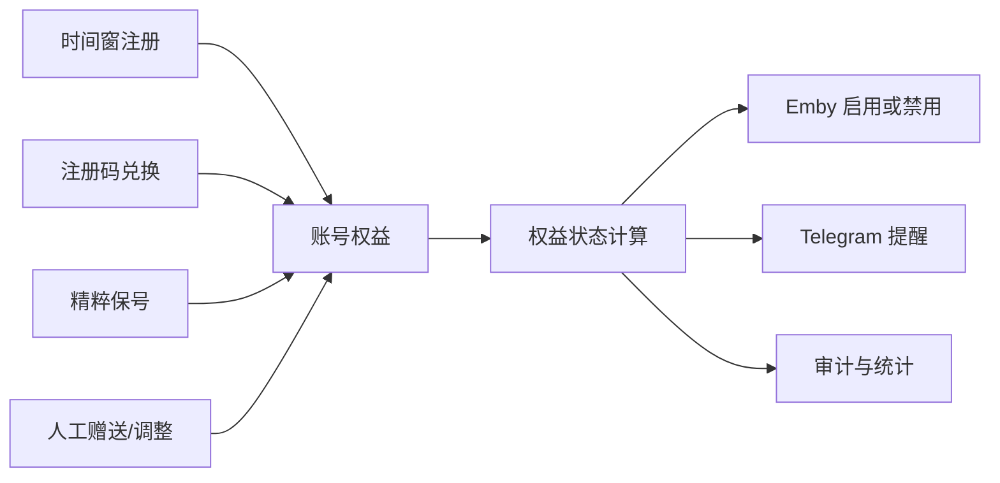

# 未完成功能总体设计：红包、注册码与保号

文档状态：`当前设计，待业务确认`  
盘点日期：2026-08-25  
范围：只做现状核对、边界设计和开发规划，不包含业务代码实现。

## 1. 结论摘要

三个功能当前并不处于同一阶段：

| 功能 | 当前状态 | 结论 |
|---|---|---|
| 红包 | 半成品 | 主链路已经存在，但并发一致性、主动过期、失败补偿和管理能力尚未闭环。 |
| 注册码 | 未实现 | 现有代码只有自由开放和时间窗注册；注册码目前只存在于旧设计稿。 |
| 保号 | 未定义、未实现 | `TODO` 只有名称，代码和文档没有统一业务口径，需要先确认规则。 |

推荐顺序：先补强红包资金一致性，再建立“账号权益”底座，随后开发注册码，最后在同一权益底座上落地保号。

## 2. 当前代码事实

### 2.1 红包已有能力

- `bot/database/models/red_packet.py` 已有红包与领取记录模型。
- `bot/services/red_packet_service.py` 已有创建、随机/平均/专属领取、过期退款逻辑。
- `bot/handlers/command/user/red_packet.py` 已有 `/rp` 命令、私聊向导、封面生成和群内发送。
- `bot/handlers/user/red_packet.py` 已有抢红包回调和结束状态更新。
- `bot/services/redpacket_preview.py`、FastAPI 路由和 Web 页面已支持样式预览。
- 数据库启动阶段使用 `Base.metadata.create_all()` 创建缺失表，因此模型可在新库创建；但 Alembic 迁移中没有对应版本，现有库的结构演进不可审计。

### 2.2 红包主要缺口

1. **领取并发不安全**：服务先读取红包，再在 Python 中计算和修改。多人同时领取时可能读取同一份剩余额度，唯一索引只能防止同一用户重复领取，不能防止不同用户超领。
2. **余额扣减不具备原子条件**：扣款前先查询余额再修改，同一用户并发发红包或购物时存在余额竞争。
3. **过期依赖用户点击**：只有过期后再次抢红包才会触发退款；无人点击的红包不会准时退款。
4. **外部消息与数据库缺少完整补偿**：发送 Telegram 消息成功、绑定 `message_id` 失败时可能留下无法领取或无法追踪的消息。
5. **管理和审计不足**：缺少红包查询、强制结束、异常退款、每日限额与风险统计。
6. **部署迁移缺口**：模型存在，但缺少正式 Alembic 迁移和升级说明。

### 2.3 注册已有能力

- 用户可以在自由开放或管理员时间窗内输入“用户名 密码”注册。
- 注册流程会检查是否已经绑定 Emby，并调用 `create_and_bind_emby_user()` 创建、落库和绑定。
- 管理员已经可以开启自由注册，或设置注册时间窗。
- 精粹余额、商品和流水系统已经存在，可作为后续资格兑换的基础能力。

### 2.4 注册码缺口

- 没有注册码模型、兑换记录、生成服务、用户 FSM、管理员入口和限流。
- 没有注册名额的持久化统计口径。
- Emby 是外部系统，当前“先创建 Emby、再写本地数据库”的失败路径没有删除或禁用已创建账号的补偿动作。
- 旧设计将注册码、支付、订阅一次性绑在一起，范围过大，不适合作为第一期实现。

### 2.5 保号现状与本文假设

仓库中只有“保号设计 / 保号功能”的待办，没有业务定义。本文暂按以下含义设计：

> 保号是用户通过满足周期性条件，延长 Emby 账号的有效权益；超过有效期和宽限期仍未完成保号，则自动禁用 Emby 账号，但不删除账号和观看数据。

如果你说的“保号”是仅检查 Emby 播放活跃度、仅检查 Telegram 群活跃度，或完全不同的规则，需要在编码前调整本章。

## 3. 总体架构

注册码和保号不应分别直接修改 Emby Policy。两者应统一写入“账号权益”，再由一个权益执行器负责启用、提醒、宽限和禁用。



建议分成四层：

- Handler：只负责 Telegram 输入、按钮、提示与 FSM。
- Service：负责资格判断、幂等、事务、外部调用编排。
- Repository / Model：负责带锁读取、条件更新和审计记录。
- Scheduler：负责红包过期、权益提醒和到期禁用，不在 Handler 内散落后台任务。

## 4. 红包完善设计

### 4.1 一致性方案

领取事务建议采用数据库行锁：

1. `SELECT red_packets ... FOR UPDATE` 锁定红包。
2. 在锁内检查状态、有效期、专属用户、剩余份数和余额。
3. 检查 `(packet_id, user_id)` 是否已有领取记录。
4. 计算本次金额并写领取记录。
5. 原子增加领取人余额、写货币流水、更新红包汇总。
6. 同一事务提交；唯一索引冲突转换成“已领取”，不向用户暴露数据库错误。

发红包扣款也需要锁定 `user_extend` 余额行，或使用带条件的原子更新：

```sql
UPDATE user_extend
SET currency_balance = currency_balance - :amount
WHERE user_id = :user_id
  AND currency_balance >= :amount;
```

受影响行为 0 表示余额不足，避免并发透支。

### 4.2 状态机

正式状态建议限定为：

- `pending`：已预占资金，尚未成功发布 Telegram 消息。
- `active`：可领取。
- `finished`：已领完。
- `expired`：到期并已退款。
- `cancelled`：发布失败或管理员撤销，并已退款。

每次状态转换必须幂等。退款流水以 `packet_id + refund_type` 建立唯一业务键，防止重复退款。

### 4.3 Telegram 发送补偿

推荐流程：

1. 创建 `pending` 红包并预占资金，提交。
2. 生成封面并发送消息。
3. 绑定 `message_id`，将红包改成 `active`。
4. 第 2 步失败：执行幂等取消与退款。
5. 第 3 步失败：优先删除或编辑已发送消息，再执行取消与退款；若 Telegram 补偿失败，写入异常任务等待管理员处理。

“先发送生成中消息，再编辑媒体”的体验优化可以放在一致性修复之后，避免界面优化掩盖资金问题。

### 4.4 主动过期任务

- 每 30～60 秒扫描一批 `active AND expire_at <= now()` 的红包。
- 每个红包复用同一个幂等过期服务，不在调度器内重写退款逻辑。
- 退款成功后尝试移除按钮并更新 caption；消息更新失败只记录告警，不回滚资金事务。
- 启动时立即补扫一次，处理停机期间到期的红包。

### 4.5 管理能力

- 管理员查看活跃、已完成、异常红包。
- 按红包 ID 查询资金流水和领取记录。
- 对 `pending` 超时、状态不一致的红包执行“重试发布”或“取消退款”。
- 配置单笔上限、每日发放上限、份数上限和冷却时间。

## 5. 注册码设计

### 5.1 第一期边界

第一期只做“注册资格码”，不接支付、不做邀请奖励、不做套餐商城。这样可以先验证生成、兑换、并发和补偿链路。

### 5.2 数据模型

#### `registration_codes`

| 字段 | 说明 |
|---|---|
| `id` | 主键。 |
| `code_digest` | 注册码摘要，数据库不保存完整明文。 |
| `code_prefix` | 用于管理员识别和查询的短前缀。 |
| `status` | `active / disabled / expired / exhausted`。 |
| `max_uses`、`used_count` | 最大次数和已成功使用次数。 |
| `expires_at` | 失效时间，可空。 |
| `bound_user_id` | 可选，仅允许指定 Telegram 用户。 |
| `bypass_time_window` | 是否允许在注册关闭时使用。 |
| `grant_days` | 注册成功后授予的初始权益天数。 |
| `batch_id`、`meta` | 发放批次、渠道与备注。 |
| 审计字段 | 创建人、禁用人和时间等。 |

#### `registration_code_attempts`

记录所有成功和失败尝试：用户、注册码、结果、失败原因、时间和有限的风控信号。成功记录对 `(code_id, user_id)` 建唯一约束。

#### `registration_events`

只记录成功完成的注册事实，作为时间窗名额统计的真相源。字段包括用户、Emby 用户、注册渠道、注册码、窗口标识和策略快照。

### 5.3 生成与存储

- 使用密码学安全随机数生成，展示为便于人工输入的分段字符串。
- 数据库只存带服务端 pepper 的 HMAC 摘要；管理员生成后只展示一次明文。
- 支持单个生成和批量生成，批量必须有 `batch_id`。
- 日志、异常、Telegram callback data 中不得出现完整注册码。

### 5.4 兑换流程

1. 用户选择“使用注册码”。
2. 限流通过后，标准化输入并计算摘要。
3. 锁定注册码行，校验状态、有效期、次数、绑定用户和时间窗策略。
4. 创建 `pending` 兑换上下文，进入用户名密码输入。
5. 再次锁定并复核注册码，然后调用注册编排服务。
6. Emby 创建和本地绑定成功后，同一数据库事务增加 `used_count`、写成功尝试、注册事件和账号权益。
7. 用户名冲突或 Emby 创建失败不消耗次数；失败原因落审计。

由于数据库事务不能覆盖 Emby HTTP 调用，注册编排必须有补偿：本地最终提交失败时，尝试禁用或删除刚创建的 Emby 用户，并记录待人工处理的异常状态。

### 5.5 管理员功能

- 生成：数量、有效期、使用次数、指定用户、是否绕过时间窗、初始权益天数、批次备注。
- 查询：前缀、状态、批次、成功次数和失败次数。
- 操作：禁用未使用注册码；已兑换记录不可物理删除。
- 导出：默认只导出状态和短前缀；只有生成当次可导出明文。

## 6. 保号设计

### 6.1 推荐规则

建议采用“周期权益 + 多种达标方式”，不要直接用最后播放时间作为唯一条件：

- 每个账号有 `valid_until` 和可选 `grace_until`。
- 用户在到期前完成一次保号，权益延长一个周期。
- 第一期只启用一种简单方式，例如消耗固定精粹；其他方式作为后续策略。
- 到期前 7 天、3 天、1 天提醒；到期进入宽限期；宽限结束后自动禁用 Emby。
- 重新完成保号后自动启用，但管理员手动禁用、封禁或已删除的账号不得自动启用。

### 6.2 可选达标策略

| 策略 | 优点 | 风险 | 建议 |
|---|---|---|---|
| 消耗精粹 | 与现有经济系统衔接最直接、规则清楚 | 需防止精粹通胀 | 推荐第一期。 |
| Emby 播放活跃 | 用户无需额外操作 | 可能鼓励无意义播放，且同步数据可能延迟 | 可作为自动豁免，不建议作为唯一规则。 |
| Telegram 群活跃 | 有利于社群互动 | 容易刷屏，审核成本高 | 后续只计“有效行为”，不按消息条数。 |
| 管理员人工延长 | 适合补偿和特殊用户 | 人工成本高 | 必须保留。 |
| 注册码/续期码 | 便于活动和付费发放 | 与注册码权限边界容易混乱 | 第二期再扩展 `purpose=extend`。 |

### 6.3 数据模型

#### `account_entitlements`

每个 Emby 绑定账号一条当前权益：

- `user_id`、`emby_user_id`
- `status`：`active / grace / expired / suspended / closed`
- `valid_until`、`grace_until`
- `last_retained_at`、`next_reminder_at`
- `version`：乐观锁版本
- `meta`：当前策略快照

`suspended` 表示管理员禁用或封禁，优先级高于自动保号状态。

#### `account_entitlement_events`

只追加、不覆盖的权益流水：`register_grant`、`retention`、`admin_adjust`、`expire`、`disable`、`enable`。保存变更前后时间、来源、关联流水和幂等键。

### 6.4 调度与幂等

- 定时任务只选择到期候选，具体状态转换交给权益服务。
- 每次提醒使用 `user_id + entitlement_id + reminder_stage` 作为幂等键。
- 禁用操作失败时保留 `expired_pending_disable` 异常状态并重试，不能把失败写成已禁用。
- 本地权益状态与 Emby Policy 定期对账；发现人工改动时告警，不直接覆盖管理员操作。

## 7. 跨功能约束

### 7.1 事务和外部调用

- 数据库内资金、次数、事件必须在同一事务完成。
- Telegram 和 Emby 属于外部系统，使用“持久化状态 + 幂等重试 + 补偿动作”，不假装存在跨系统原子事务。
- 所有重试服务都必须接受业务幂等键。

### 7.2 时间

- 数据库存 UTC，展示时统一使用项目时区工具。
- 注册窗口、注册码过期、红包过期和保号有效期均使用带时区的业务时间。
- 不在 JSON 配置中继续扩散不可验证的自由格式时间字符串；新模型使用数据库时间字段。

### 7.3 审计与隐私

- 注册码、密码、Token 不得写入日志和审计详情。
- 失败原因使用稳定错误码，用户文案与内部诊断分离。
- 资金和权益流水不做物理删除；管理员操作记录操作者和原因。

## 8. 分阶段开发计划

### 阶段 0：规则确认

- 确认保号含义、周期、宽限期、达标方式和禁用后的恢复规则。
- 确认注册码是否绕过注册时间窗，是否仍受名额限制。
- 确认红包是否允许发给自己、是否允许匿名、限额和有效期。

### 阶段 1：红包资金闭环

- 补 Alembic 迁移。
- 修复余额扣减和领取并发。
- 增加 `pending/cancelled` 状态、发布失败补偿和幂等退款。
- 增加主动过期调度、异常查询和核心并发测试。

### 阶段 2：账号权益底座

- 新增权益主表和事件流水。
- 为现有已绑定账号制定初始化策略并生成一次性迁移数据。
- 实现状态计算、提醒、到期禁用、恢复和人工调整。
- 暂不开放自动保号入口，先验证对账和调度安全性。

### 阶段 3：注册码 MVP

- 新增注册码、尝试记录和注册事件模型。
- 实现生成、禁用、查询、限流和用户兑换 FSM。
- 将现有时间窗注册与注册码注册统一接入注册编排服务。
- 验证最后一次并发兑换、Emby 失败补偿和敏感信息脱敏。

### 阶段 4：保号 MVP

- 上线一种经确认的达标方式，推荐“固定精粹兑换一个周期”。
- 增加用户权益状态页、保号入口、提醒和管理员调整入口。
- 加入自动禁用/启用与定期对账。

### 阶段 5：体验与运营扩展

- 红包“生成中 → 编辑媒体”体验优化、统计和更多玩法。
- 注册名额、续期码、活动码、邀请奖励。
- Emby 活跃自动豁免、精粹策略和运营看板。

## 9. 编码前需要确认的业务问题

1. 保号周期是月度、季度还是自定义天数？
2. 第一期保号靠精粹、Emby 播放活跃、Telegram 活跃，还是组合条件？
3. 过期后是立即禁用，还是保留几天宽限期？
4. 保号恢复是否允许自动启用，还是必须管理员审核？
5. 注册码是否绕过关闭的时间窗？如果绕过，是否仍受本轮名额限制？
6. 注册码第一期只用于新注册，还是同时支持已绑定账号续期？
7. 红包是否允许发起人领取自己的普通红包？单笔、每日和份数上限分别是多少？

在这些问题确认前，可以先实现红包一致性修复；注册码与保号只完成技术底座，不应直接固化业务参数。

